# 🎁 [2026 最强 Cloudflare 免费节点！永久可用+免费域名｜10分钟搭建｜解锁 ChatGPT / Gemini ！] 

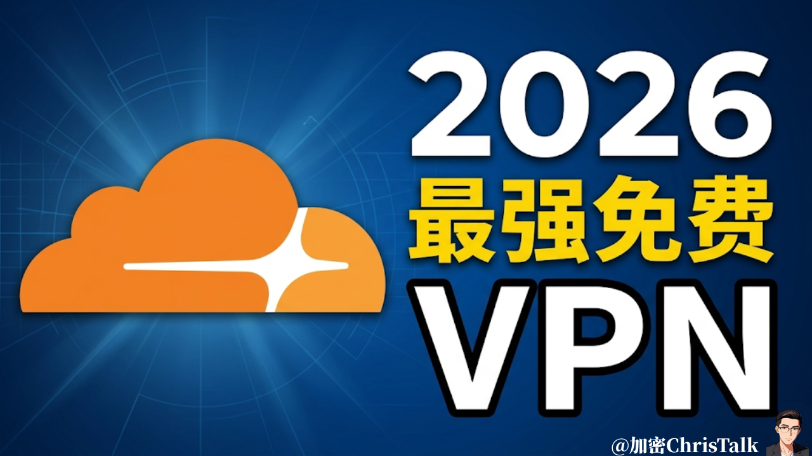{ width="300" align=left style="border-radius: 8px; margin-right: 20px; box-shadow: 0 4px 10px rgba(0,0,0,0.1); margin-bottom: 10px;" }

  <a href="https://www.youtube.com/watch?v=WNgMwaz3L5Q" target="_blank" class="md-button md-button--neutral" style="display: inline-flex; align-items: center; gap: 8px; padding: 10px 24px; font-size: 0.85rem; border-radius: 20px; text-decoration: none; font-weight: bold; border: 1px solid rgba(0,0,0,0.1); transition: all 0.3s ease;">
    <svg viewBox="0 0 576 512" style="height: 1.1em; fill: #FF0000; margin: 0; display: block;"><path d="M549.655 124.083c-6.281-23.65-24.787-42.276-48.284-48.597C458.781 64 288 64 288 64S117.22 64 74.629 75.486c-23.497 6.322-42.003 24.947-48.284 48.597-11.412 42.867-11.412 132.305-11.412 132.305s0 89.438 11.412 132.305c6.281 23.65 24.787 41.5 48.284 47.821C117.22 448 288 448 288 448s170.781 0 213.371-11.486c23.497-6.321 42.003-24.171 48.284-47.821 11.412-42.867 11.412-132.305 11.412-132.305s0-89.438-11.412-132.305zm-317.51 213.508V175.185l142.739 81.205-142.739 81.201z"/></svg>
    立即观看完整视频
  </a>

 
<!-- more -->
---

## 🎯 概述

如果你在找一种真正“长期可用”的免费节点方案，那么2026年，这套基于 Cloudflare 的搭建方式，可能是目前最值得尝试的一种选择。

 

它最大的特点只有三个：免费、稳定、速度极快！不需要服务器、不需要额外成本，甚至连域名都可以免费获取；整个搭建过程从零开始，大约10分钟就能完成。同时，由于依托 Cloudflare 本身的网络基础，这套方案在稳定性和可用性方面，也远远优于传统的临时节点或不稳定方案。

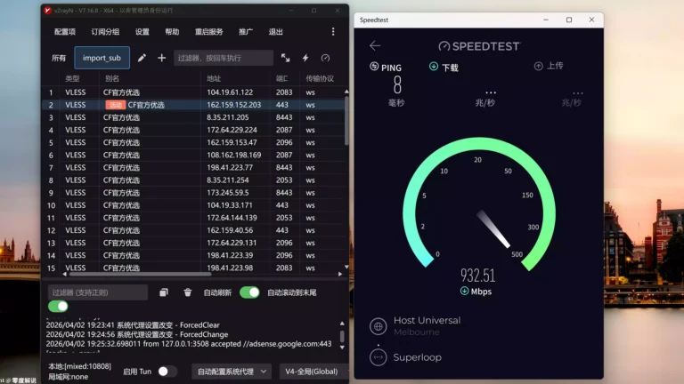

相比过去那些复杂、容易失效、需要频繁维护的方式，这种方案更像是一种“轻量级长期解决方案”：一次搭建，持续可用，几乎不需要额外折腾，非常适合个人用户或轻度使用场景。

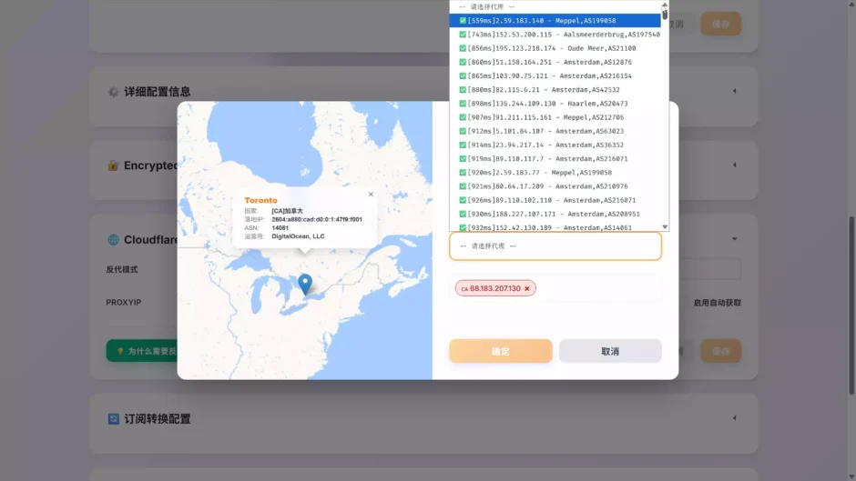

接下来，我会从准备工作开始，一步一步带你完整搭建这套 Cloudflare 免费节点方案，并把过程中所有关键细节和容易踩坑的地方，全部讲清楚。

---

## 📋 实操流程

1. **[第一步]**：

注册一个永久免费的域名，下方就是视频所示的免费域名注册链接：

免费域名注册网站：[点击跳转](https://www.dnshe.com/)

注册登入以后，即可注册5个永久免费的域名，根域名选择ccwu.cc 或者 us.ci 都是完全免费的！

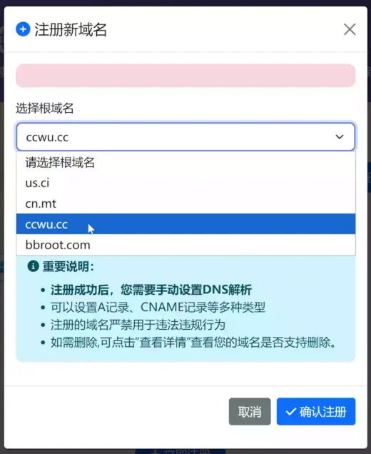
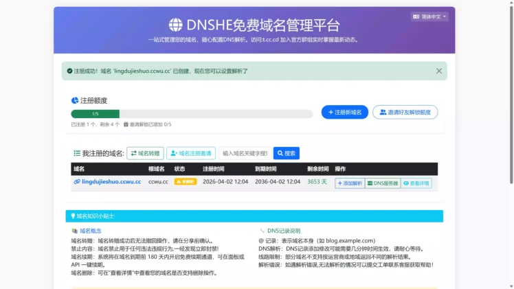

2. **[第二步]**：

注册并登入 Cloudflare 平台，然后将上方注册的免费域名托管进去

[点击跳转](https://www.cloudflare.com/)

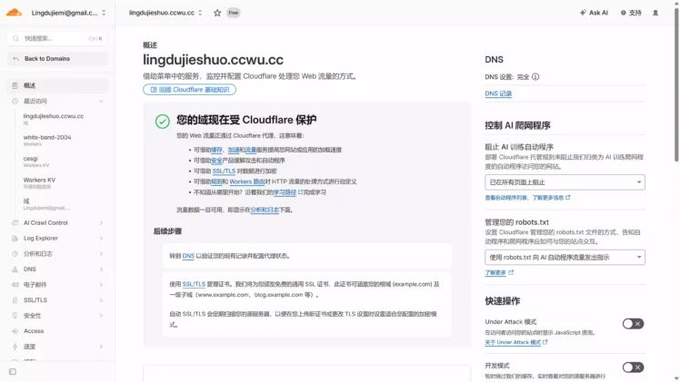

3. **[第三步]**：[简述]

创建KV 空间，在Cloudflare后台找到：存储和数据库 – Worker KV，来创建一个KV空间以备后面对接。

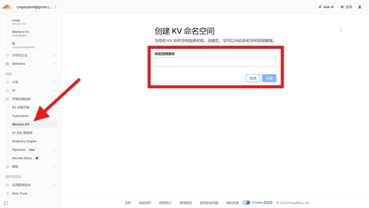

4. **[第四步]**：[简述]

创建Pages,在Cloudflare后台找到 Workers 和 Pages

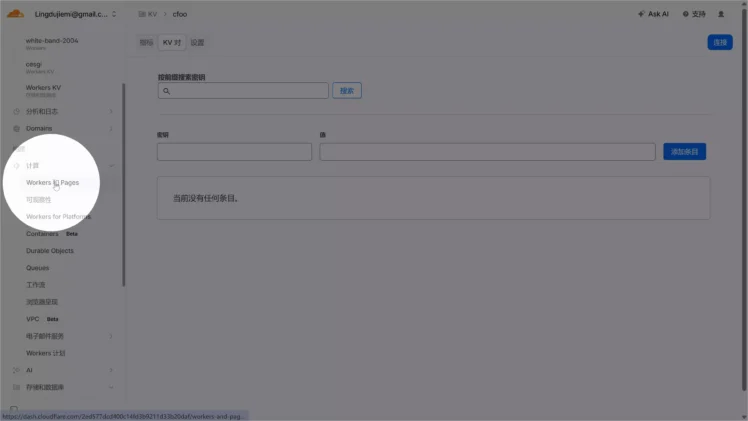

进入以后，选择下方第二个选项，就是创建Pages，如下图所示：

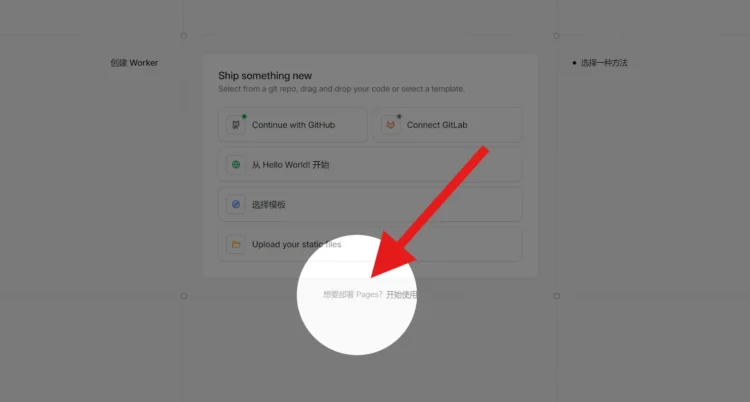

接着需要上传由[CMliu](https://github.com/cmliu/edgetunnel)开源的程序，他的源码是明文的，你可以自己去获取查看，目前是开源到GitHub上。或者直接下载Pages的专属安装包！

[点击下载](https://github.com/cmliu/edgetunnel/archive/refs/heads/main.zip)

下载以后直接将附件上传到Pages，进行步骤即可

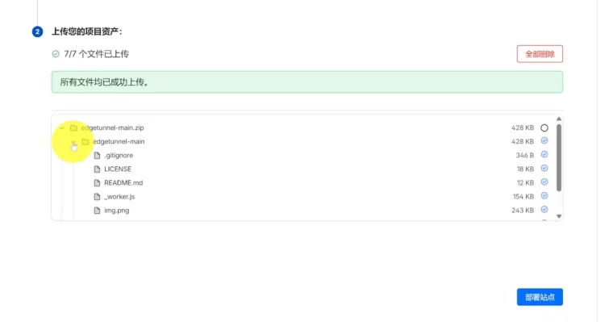

* 部署完成后点击 `继续处理站点` 后，选择 `设置` > `环境变量` > **制作为生产环境定义变量** > `添加变量`。 变量名称填写 **ADMIN**，值则为你的管理员密码，后点击 `保存` 即可。
* 返回 `部署` 选项卡，在右下角点击 `创建新部署` 后，重新上传 main.zip 文件后点击 `保存并部署` 即可。

2. 绑定 KV 命名空间：

    * 在 `设置` 选项卡中选择 `绑定` > `+ 添加` > `KV 命名空间`，然后选择一个已有的命名空间或创建一个新的命名空间进行绑定。
    * `变量名称` 填写 `KV`，然后点击 `保存` 后重试部署即可。

3. 给 Pages绑定 CNAME自定义域：

    * 在 Pages控制台的 `自定义域` 选项卡，下方点击 `设置自定义域`。
    * 填入你的自定义次级域名，注意不要使用你的根域名，例如：您分配到的域名是 lingdujieshuo.ccwu.cc，则添加自定义域填入 lingdujieshuo.ccwu.cc 即可；
    * 按照 CF 的要求将返回你的域名DNS服务商，添加 该自定义域 `lizi` 的 CNAME 记录 `edgetunnel.pages.dev` 后，点击 `激活域` 即可。

4. 访问后台：

    * 访问 `https://lingdujieshuo.ccwu.cc/admin` 输入管理员密码即可登录后台。

    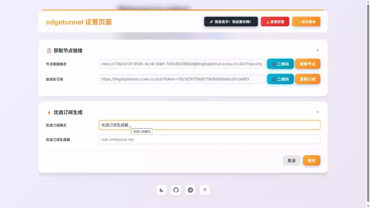

    接着把上方的节点链接格式或者自适应订阅地址，导入到你的代理软件里，他支持 VLESS、Trojan 等主流协议，深度集成加密传输。

    ## ✨ 核心特性

* **🛡️ 协议支持：** 支持 VLESS、Trojan 等主流协议，深度集成加密传输。
* **📊 管理面板：** 内置可视化后台，支持实时配置修改、日志查看及流量统计。
* **🛠️ 部署灵活：** 完整适配 CF Workers 及 CF Pages (GitHub / 上传)。
* **🔄 订阅系统：** 内置自动订阅生成及混淆转换，适配主流客户端（Clash, Sing-box, Surge 等）。
* **⚡ 性能加速：** 支持自定义 ProxyIP、SOCKS5/HTTP 链式代理及优选 API，优化网络延迟。
* **🌐 多台适配：** 完美适配 Windows, Android, iOS, MacOS 及各种软路由固件。

比如我们可以使用常见的 [V2Ray客户端](https://github.com/2dust/v2rayN) 来进行导入代理节点，就可以愉快的使用Cloudflare永久免费的VPN节点

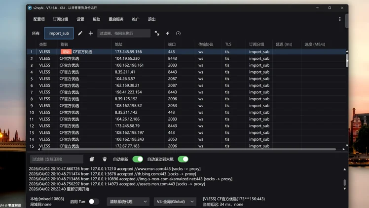

V2Ray 开源下载：[点击前往](https://github.com/2dust/v2rayN)、

---

## ⚠️ 免责声明
* 本文内容仅供技术交流，请遵守当地法律法规。