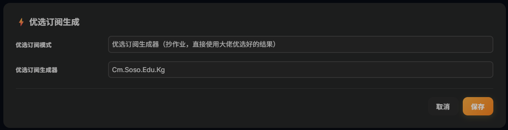

# 🎁 [晚高峰流畅 4K！拯救你的 Cloudflare 免费节点 | 测速优选与自建 ProxyIP 终极指南]  

{ width="300" align=left style="border-radius: 8px; margin-right: 20px; box-shadow: 0 4px 10px rgba(0,0,0,0.1); margin-bottom: 10px;" }

**本期要点：** 使用 Clouflare 搭建的节点，在使用默认功能优选节点时，由于使用的人数较多，导致节点能用但延迟较高、不稳定且大量节点无法连接，本期视频从根本原因出发，按优先级逐步优化，帮你把延迟从 1000ms+ 降到 100ms 以内，确保秒开4K视频，且播放速度稳定。

<div style="margin-top: 25px; text-align: center;">
  <a href="https://youtu.be/ECIO8Vdrj6s?si=YtZt850cjIW8wFFm" target="_blank" class="md-button md-button--neutral" style="display: inline-flex; align-items: center; gap: 8px; padding: 10px 24px; font-size: 0.85rem; border-radius: 20px; text-decoration: none; font-weight: bold; border: 1px solid rgba(0,0,0,0.1); transition: all 0.3s ease;">
    <svg viewBox="0 0 576 512" style="height: 1.1em; fill: #FF0000; margin: 0; display: block;"><path d="M549.655 124.083c-6.281-23.65-24.787-42.276-48.284-48.597C458.781 64 288 64 288 64S117.22 64 74.629 75.486c-23.497 6.322-42.003 24.947-48.284 48.597-11.412 42.867-11.412 132.305-11.412 132.305s0 89.438 11.412 132.305c6.281 23.65 24.787 41.5 48.284 47.821C117.22 448 288 448 288 448s170.781 0 213.371-11.486c23.497-6.321 42.003-24.171 48.284-47.821 11.412-42.867 11.412-132.305 11.412-132.305s0-89.438-11.412-132.305zm-317.51 213.508V175.185l142.739 81.205-142.739 81.201z"/></svg>
    立即观看完整视频
  </a>
</div>

<br clear="left">
<!-- more -->
---

### 视频主要内容

* **流量链路分析**：延迟高的三个原因
* **修复 ProxyIP**：消除大量连接失败节点（必做）
* **CloudflareSpeedTest 本地测速**：找到最优 CF IP（必做）
* **开启 ECH**：减少 GFW 干扰，降低延迟抖动（强烈推荐）
* **调整优选端口**：不同运营商对比测试（可选）
* **自建 ProxyIP**：完全控制出口质量（有 VPS 则推荐）
* **SOCKS5 链式代理**：效果最强的私人出口方案（有 VPS 则推荐）

---

### 先搞清楚：延迟高的根源在哪里

优化前必须理解流量走的完整路径，每一跳都会叠加延迟：

```plaintext
你的设备
  ↓ 优选IP 决定入口质量
Cloudflare 边缘节点
  ↓ Worker 运行（10ms CPU 限制）
CF Worker
  ↓ ProxyIP 决定出口质量
ProxyIP 中转节点
  ↓
目标网站
```
延迟高一般只有三个根因：根因典型现象优化方向ProxyIP 失效或质量差大量节点连接失败更换或自建 ProxyIP优选 IP 质量差延迟 1000ms+ 且参差不齐本地测速找最优 IPGFW 干扰或 QoS 限速延迟抖动大、时好时坏ECH、协议切换、自建出口
### 操作步骤

#### 第一步：修复 ProxyIP（必做，效果最显著）

背景：CF Worker 被 Cloudflare 限制，无法直接访问 Cloudflare 托管的网站，需要 ProxyIP 做中转。ProxyIP 失效是节点大量失败最主要的原因。

进后台 → 设置 → ProxyIP，填入多个备用地址，用换行分隔，失效时自动切换：

```plaintext
proxyip.cmliussss.net,
cdn-all.xn--b6gac.eu.org,
cdn.xn--b6gac.eu.org,
edgetunnel.anycast.eu.org,
cdn.anycast.eu.org
```

验证是否有效：https://check.proxyip.cmliussss.net/

预期效果：配置后，连接失败的节点基本消除。

### 第二步：用本地测速找最优 IP（核心优化）

edgetunnel 默认随机抽取 CF IP，质量完全靠运气。通过本地测速找到对你当前网络延迟最低的 IP，是最直接有效的优化。

#### 下载 CloudflareSpeedTest

**Windows**

前往 [CloudflareSpeedTest Releases](https://github.com/XIU2/CloudflareSpeedTest/releases) 下载 `cfst_windows_amd64.zip`，解压后得到 `cfst.exe`，在解压目录打开终端运行。

**macOS**

```bash
mkdir ~/cfst && cd ~/cfst

# Intel Mac
curl -L -o cfst.zip https://ghfast.top/https://github.com/XIU2/CloudflareSpeedTest/releases/download/v2.3.4/cfst_darwin_amd64.zip

# Apple Silicon (M 系列)
# curl -L -o cfst.zip https://ghfast.top/https://github.com/XIU2/CloudflareSpeedTest/releases/download/v2.3.4/cfst_darwin_arm64.zip

unzip cfst.zip
chmod +x cfst
```
Linux
```bash
mkdir ~/cfst && cd ~/cfst

wget https://ghfast.top/https://github.com/XIU2/CloudflareSpeedTest/releases/download/v2.2.5/CloudflareST_linux_amd64.tar.gz

tar -zxvf cfst_linux_amd64.tar.gz
chmod +x cfst
```

#### 关闭代理后测速

必须关闭代理，否则测出的是代理服务器到 CF 的延迟，对本机没有意义。

```bash
unset http_proxy https_proxy HTTP_PROXY HTTPS_PROXY ALL_PROXY all_proxy

# 验证已关闭（应输出空）
echo $http_proxy
```

用 HTTPing 模式测速
```bash
cfst.exe -httping -tl 150 -sl 5 -p 15
```

| 参数 | 含义 |
| :--- | :--- |
| `-httping` | HTTP 测速模式，必须加，过滤掉“ TCP 通但 HTTP 代理不可用”的假可用 IP |
| `-tl 150` | 只保留延迟 150ms 以内的 IP |
| `-sl 5` | 只保留下载速度 5MB/s 以上的 IP |
| `-p 15` | 输出前 15 个结果 |

为什么要用 HTTPing 而不是默认 TCP 模式？TCP 测速会有大量“看起来可用、实际在客户端 Timeout”的 IP，而 HTTPing 模式与 Clash 客户端测速逻辑一致，结果更准确。

实测参考（每次不同，仅示例）：

```plaintext
IP 地址         延迟(ms) 速度(MB/s) 地区
162.159.45.46   44.10    13.03      NRT (东京)
162.159.44.188  45.34    11.82      NRT (东京)
172.64.53.100   59.02    13.42      NRT (东京)
172.64.52.232   62.29    13.43      NRT (东京)
162.159.38.157  64.46    12.82      NRT (东京)
```

注意：TCP 测速时 SIN（新加坡）节点可用，但在客户端实测时 Timeout。建议在 Clash 里全部测速后，删掉经常 Timeout 的地区节点。

把测速结果填入后台
后台 → 优选订阅生成 → 模式选「自定义订阅（支持汇聚订阅）」

格式为 `IP地址:端口#备注名`，每行一个：
```plaintext
162.159.45.46:443#NRT优选1
162.159.44.188:443#NRT优选2
172.64.53.100:443#NRT优选3
172.64.52.232:443#NRT优选4
162.159.38.157:443#NRT优选5
```
### 备选方案：使用优选订阅生成器（小白一键抄作业）

如果你觉得本地命令行测速太麻烦，或者自己测出来的 IP 效果都不太理想，可以直接使用网络大佬们搭建的“优选订阅生成器”。

这些接口背后有服务器在 24 小时不间断地筛选 Cloudflare 全网优质 IP。你只需要填入接口，系统就会自动帮你获取当前最高速的节点，完全不用自己动手测速。

**操作步骤：**

1. 进入 edgetunnel 后台设置页面，向下滚动找到 **「优选订阅生成」** 板块。
2. **优选订阅模式**：在下拉菜单中选择「优选订阅生成器（抄作业，直接使用大佬优选好的结果）」。
3. **优选订阅生成器**：在输入框中，填入以下任意一个稳定的大佬优选地址（任选其一即可）：

```plaintext
Cm.Soso.Edu.Kg
Sub.Cmliussss.Net
Owo.000o.Ooo
```


### 第四步：开启 ECH（推荐）

原理：ECH（Encrypted Client Hello）是 TLS 1.3 的扩展，对握手阶段的 SNI 字段加密。GFW 无法通过 SNI 识别目标域名，从而减少针对性的 QoS 限速和干扰，**降低延迟抖动，提高连接稳定性**。

前提：Clash Verge Rev 使用 Meta 内核，已原生支持 ECH，可以直接用。

**操作步骤：**
进入管理后台，找到 **【Encrypted Client Hello】** 设置面板，勾选 **「启用」** 即可，其他所有选项保持默认，点击保存。

保存后重新拉取订阅，节点链接中会自动附加 ECH 参数。

> 💡 **排错提示**
> 如果开启后节点全部不通，先关掉 ECH 验证基础链路是否正常，再重新测试。ECH 应该在基础链路稳定的前提下开启。

---

### 第五步：测试不同端口（可选）

默认端口 443，但不同运营商对不同端口的 QoS 策略不同，可以逐一测试：

后台 → 优选订阅生成 → 「指定优选端口」

| 端口 | 说明 |
| :--- | :--- |
| `443` | 默认，最通用 |
| `2053` | 联通/移动可能更快 |
| `2083` | CF 支持的备用 TLS 端口 |
| `2087` | CF 支持的备用 TLS 端口 |
| `8443` | 备用 |

建议每个端口单独跑一次测速，对比延迟后选最低的固定使用。

### 第六步（有 VPS）：自建 ProxyIP

公共 ProxyIP 被大量用户共享，存在被滥用、限速甚至封锁的风险。如果你有一台 VPS（日本或新加坡节点效果最佳），可以自建 ProxyIP，完全控制出口质量。

Nginx 配置示例：

```nginx
server {
    listen 443 ssl;
    server_name proxyip.yourdomain.com;

    ssl_certificate      /path/to/cert.pem;
    ssl_certificate_key  /path/to/key.pem;
    ssl_protocols        TLSv1.2 TLSv1.3;

    location / {
        proxy_pass          https://$host;
        proxy_ssl_server_name on;
        proxy_set_header    Host $host;
        proxy_set_header    X-Real-IP $remote_addr;
        resolver            1.1.1.1 valid=60s;
        resolver_timeout    5s;
    }
}
```
后台 → ProxyIP → 填入 proxyip.yourdomain.com:443

链路对比：
```bash
公共 ProxyIP：本地 → CF优选IP → Worker → 公共ProxyIP（不可控） → 目标
自建 ProxyIP：本地 → CF优选IP → Worker → 自己VPS（稳定可控） → 目标
```
### 第七步（有 VPS）：SOCKS5 链式代理

如果你有 VPS，可以让 Worker 的出口流量直接经过你的 SOCKS5 节点落地，效果最强：
```bash
GO2SOCKS5 = *
SOCKS5    = user:password@your-vps-ip:1080
```
或通过订阅路径动态指定（单节点级别）：
```bash
/socks5=user:password@your-vps-ip:1080
```
效果：所有流量从 VPS 落地，相当于把 edgetunnel 变成了一个有固定出口的私人节点。

### 常见问题

**测速工具测出来很好，但 Clash 里还是 Timeout**

* **原因**：TCP 测速会过滤不掉“ TCP 可达但 HTTP 代理不可用”的 IP，必须用 HTTPing 模式。
* **解决**：测速时加 `-httping` 参数，再把结果填入自定义订阅。

**ProxyIP 填了多个，但节点还是失败**

* **原因**：填入的 ProxyIP 本身已经失效，或格式有误。
* **解决**：用验证工具 [check.proxyip.cmliussss.net](https://check.proxyip.cmliussss.net) 逐一测试，只保留验证通过的地址。

**开了 ECH 之后节点全部不通**

* **原因**：客户端版本、DNS 配置或链路环境不支持 ECH。
* **解决**：先关闭 ECH，确认基础链路正常后，再用保守配置（ECH DNS 填 `cloudflare-ech.com`，ECH SNI 留空）重新测试。

**测速之后多久需要重测**

* **原因**：CF IP 的路由质量会随时间变化，优选结果不是永久有效的。
* **解决**：建议每周重测1-2次，或发现节点明显变慢时重测。

## ⚠️ 免责声明
* 本文内容仅供技术交流，请遵守当地法律法规。