# 🎁 [【2026神卡推荐】免翻墙直连 ChatGPT/Gemini 的香港漫游神卡 vs 月付 $0.3 零成本免写卡器保号卡！] 

{ width="300" align=left style="border-radius: 8px; margin-right: 20px; box-shadow: 0 4px 10px rgba(0,0,0,0.1); margin-bottom: 10px;" }

**本期要点：** [这里简述视频的核心价值，吸引读者往下看]。本教程手把手带你通过验证，建议收藏！

  <a href="[YouTube链接]" target="_blank" class="md-button md-button--neutral" style="display: inline-flex; align-items: center; gap: 8px; padding: 10px 24px; font-size: 0.85rem; border-radius: 20px; text-decoration: none; font-weight: bold; border: 1px solid rgba(0,0,0,0.1); transition: all 0.3s ease;">
    <svg viewBox="0 0 576 512" style="height: 1.1em; fill: #FF0000; margin: 0; display: block;"><path d="M549.655 124.083c-6.281-23.65-24.787-42.276-48.284-48.597C458.781 64 288 64 288 64S117.22 64 74.629 75.486c-23.497 6.322-42.003 24.947-48.284 48.597-11.412 42.867-11.412 132.305-11.412 132.305s0 89.438 11.412 132.305c6.281 23.65 24.787 41.5 48.284 47.821C117.22 448 288 448 288 448s170.781 0 213.371-11.486c23.497-6.321 42.003-24.171 48.284-47.821 11.412-42.867 11.412-132.305 11.412-132.305s0-89.438-11.412-132.305zm-317.51 213.508V175.185l142.739 81.205-142.739 81.201z"/></svg>
    立即观看完整视频
  </a>

 
<!-- more -->
---

在日常跨境办公、Web3 交互和海外账号注册中，拥有一个稳定的海外手机号和纯净的网络环境绝对是刚需。但很多人一直面临两个痛点：想用香港手机卡漫游上网，却发现香港 IP 被 ChatGPT 和 Gemini 无情屏蔽；想养个海外号接验证码，月租太贵，甚至还要花两百多去买专门的写卡器。

今天为大家带来 **KiteSim** 旗下的两款极致性价比神卡。一款彻底打破了“香港 IP 不能用 AI”的魔咒，实现国内免翻墙直接访问外网，同时完美解锁 ChatGPT、Gemini 和全网流媒体！另一款则把接码保号的月租压到了离谱的 **$0.3 美元**，而且完全不需要实体硬件写卡器！

---

## 💡 两款神卡核心属性对比

| 核心维度 | 🇭🇰 香港带号漫游流量卡（主推） | 🍁 KiteSim 加拿大保号卡 |
| :--- | :--- | :--- |
| **月租/价格** | **低至 $0.56 / GB**（0月租，长周期流量包） | **$0.1 美元 / 月**（几乎白嫖，网页直接接码） |
| **核心功能** | 国内免 VPN 翻墙、带有香港实体号码 | 海外短信接码、注册账号、长期保号 |
| **网络漫游** | 漫游直接绕过 GFW，开数据即上外网 | 适合在国内长期待机接短信 |
| **AI 解锁能力** | **直接解锁 ChatGPT、Gemini 等 AI** | 仅作为号码使用（不含大流量） |
| **最适合人群** | 经常出差旅游、厌倦梯子、重度 AI 依赖者 | 需要批量养号、绑定银行/交易所/APP 的用户 |
| **购买链接** | [立即抢购香港漫游卡](https://h5.kitesim.co/register/?invite=CSZHOC) | [立即申请加拿大神卡](https://h5.kitesim.co/register/?invite=CSZHOC)  |

---

## 🇭🇰 方案一：香港带号漫游流量卡 —— 免 VPN 翻墙 + 破除 AI 锁区的双料神器

长期以来，用过香港流量卡（如 MySIM、ClubSim 等）的朋友都知道一个巨大的痛点：虽然能在国内通过漫游直接上外网，但由于 OpenAI 和 Google 的安全策略，香港本地 IP 是直接被拒之门外的，根本打不开 ChatGPT 和 Gemini！

但 KiteSim 最新推出的这款香港带号流量卡，通过底层高端的路由优化与干净的 IP 库，直接斩断了这个痛点，带来了前所未有的自由体验：

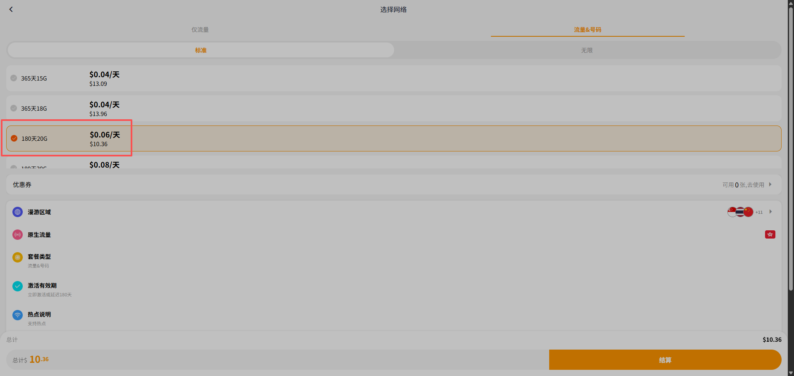

### 1. 国内插卡即用，彻底告别 VPN 和梯子
不需要在手机上安装任何 V2Ray、Clash 或者配置复杂的优选 IP。只要在国内开启“数据漫游”，就能合法、合规、稳定地直连海外互联网。无论是日常刷 YouTube、看推特，还是临时出差旅游，都是不掉线的随身神器。

### 2. 打破魔咒：原生支持 ChatGPT / Gemini / Claude
这是这张卡最强悍的“杀手锏”！不同于市面上绝大多数被 AI 平台标记为“不受支持地区”的普通香港卡，**它的网络出口能够直接绕过 AI 巨头的区域风控**。不需要额外再挂一层美区 ProxyIP，手机开数据直接秒开 ChatGPT 和 Gemini App！

### 3. 自带合规香港号码，双向奔赴
它不仅是一张纯流量卡，还配套了一个正规的香港手机号码。这就意味着你在享受免翻墙高速上网的同时，还能用它注册和绑定微信支付（HK）、支付宝（HK）、香港虚拟银行以及海外主流工具，一卡多用。

### 4. 极致性价比：流量低至 $0.56/GB，且有效期超长
相比于市面上动辄规定每月必须用完的传统套餐，KiteSim 提供了极其灵活的**长周期大流量包**，没有隐藏月租，按需购买：
* **100G 流量包（90天有效）：** 售价仅 $55.8，折算下来**每千兆（GB）低至 $0.56 美元**。
* **50G 流量包（180天有效）：** 折算约 $0.58/GB，半年不用担心过期。
* **20G 流量包（365天有效）：** 一年有效期，折算仅 $0.64/GB，当做防失联备用卡极为划算。

> **👉 独家申领通道：** **[点击此处立即开通香港免翻墙+AI解锁神卡](https://h5.kitesim.co/register/?invite=CSZHOC)**
> *(提示：注册或下订单时如需填写，请认准专属优惠邀请码：**`CSZHOC`**)*

---

## 🍁 方案二：KiteSim 加拿大卡 —— $0.3/月，免写卡器的终极保号天花板

如果你只需要一个正经的海外号码用来接收银行验证码、注册 Telegram、WhatsApp、推特或者是各种 Web3 交易所，那么这款加拿大卡直接把持卡成本降到了行业冰点。

最重要的是，它彻底解决了市面上其他 eSIM 产品的硬件门槛限制：

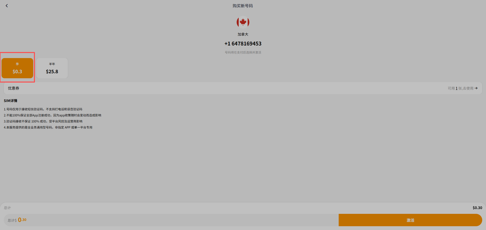

### 1. 零硬件成本，拒绝两百元的“写卡器”刺客
以前国内用户想玩海外 eSIM，手机不支持的话，必须得先花 **200多元人民币** 去买一个类似 5Gesim 或 Xesim 的实体写卡器芯片，还没开始用就先亏一笔硬件钱。
而 KiteSim 这款卡**完全不需要任何实体写卡器设备**！它支持直接在平台上在线接收短信验证码，网页即开即用，把接码保号做成了纯粹的线上高性价比方案，省时省力更省钱。

### 2. 月租仅需 $0.1 美元
折合人民币一个月才 1 块钱左右，一年下来不到一杯奶茶钱，真正做到无痛、无压力长期养号。

### 3. 高权重实体级别质量
相比于 Google Voice 等经常被各大金服、社交平台批量封杀拉黑的虚拟号段（VOIP），KiteSim 提供的号码段非常干净，注册风控系数极低，大厂账号存活率大幅提升。

> **👉 独家申领通道：** **[点击此处立即开通香港免翻墙+AI解锁神卡](https://h5.kitesim.co/register/?invite=CSZHOC)**
> *(提示：注册或下订单时如需填写，请认准专属优惠邀请码：**`CSZHOC`**)*
---

## 🔧 进阶必看：国区手机没有 eSIM 怎么办？一卡解锁全球流量的 Xesim 终极指南！

前面提到的 KiteSim 加拿大保号卡通过“网页端在线收短信”帮大家省下了写卡器的硬件成本。但如果你希望在日常的主力手机上随心所欲地购买和切换全球各地极其便宜的 **eSIM 流量包**，国区行货手机（无论是苹果还是安卓）被物理阉割 eSIM 功能就是一个绕不过去的硬伤。

想要无痛破解这个限制，你只需要在卡槽里塞入一张物理形态的 **Xesim 写卡器芯片**。它能让你的国区手机立刻拥有原生 eSIM 的配置能力！

> **👉 官方正品抢购通道：** **[点击此处立即订购 Xesim 实体写卡器芯片](https://xesim.cc/?DIST=RkdHGlk%3D)**
> *(提示：下单前请务必仔细阅读下方的型号对比与避坑指南，绝对能帮你省下大笔冤枉钱！请认准专属优惠邀请码：**`KX13bx`**)*

---

### 🛒 三款核心型号怎么选？（避坑指南 + 优缺点深扒）

Xesim 目前推出了 **X1、X2、X2 Pro** 三款型号。虽然它们最高都能在卡内同时存储约 **30 个 eSIM 配置**，但在**免费写卡寿命**和**底层通信协议**上有着致命的差别：

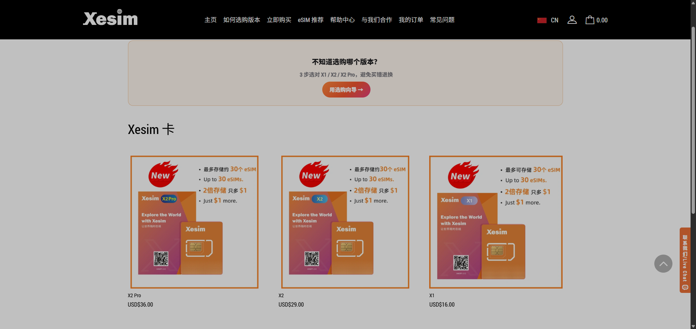

#### 1. X1 基础版（$16.00）—— 表面便宜的“限制次数卡”
* **最大硬伤（避坑警告！）：** 很多人以为它便宜就冲了，但它最大的限制根本不是读写速度，而是**只提供 5 次免费写卡（下载 eSIM）的权限！** 
* **为什么不推荐？** 你在网上买一个“去日本 3 天 5G 流量”的临时 eSIM 套餐，下载进卡里就算消耗了 **1 次** 写入；过两月去一趟香港再买个临期包，又消耗 **1 次**。5 次免费额度用完后，后续每一次往卡里写入新的 eSIM 套餐**都是要另外付费买写卡额度的**！长痛不如短痛，非常不划算。
* **适用人群：** 仅适合一辈子只准备写入 1~2 张固定长效保号卡（如终身不用换卡的长期业务），基本不频繁购买出境临时流量包的人。

#### 2. X2 进阶版（$29.00）—— 无限写卡的“安卓性价比之王”
* **核心升级：** 彻底解锁了**无限次免费写卡**权限！哪怕你一周换三个国家、疯狂白嫖或购买几块钱的临时流量包，芯片都能随心所欲反复擦写，再也无须为写卡次数持续充值。
* **操作局限：** 它仅支持在安卓系统上进行 App 扫码下载和写卡。
* **适用人群：** 安卓主力手机用户；或者是“手里有一台备用安卓手机”，愿意每次写卡时先插在安卓机里搞定，再拔下卡插回 iPhone 主力机使用的轻度折腾用户。

#### 3. X2 Pro 旗舰版（$36.00）—— 苹果 iPhone 用户的“唯一神装”
* **核心黑科技：** 在拥有 **X2 无限次免费写卡**的基础上，它是市面上唯一集成了原生 **STK / BIP 底层电信协议**的高阶芯片。
* **为什么 iPhone 必选？** 因为苹果 iOS 系统严苛的沙盒机制封锁了普通 App 的写卡通道，只有 X2 Pro 能绕过限制，**彻底摆脱对安卓备用机的依赖，完美支持在苹果 iPhone 本机上进行 OTA 空中下载与一键卡片切换！**
* **适用人群：** 所有的苹果 iPhone 用户，尤其是追求极致体验、不想来回换卡插拔的商务出差和跨境大佬。

---

### 📱 极简实操：安卓手机的使用方法（X1 / X2 / X2 Pro 通用）

得益于安卓系统开放的底层权限，在安卓机上配置 eSIM 就像使用普通 App 一样简单丝滑：

1. **插入芯片**：将购买的 Xesim 芯片直接当作普通 Nano-SIM 卡放入安卓手机卡槽。
2. **下载工具**：前往官网下载安装配套的卡片管理 App（如 Xesim 官方客户端或开源的 EasyEUICC）。

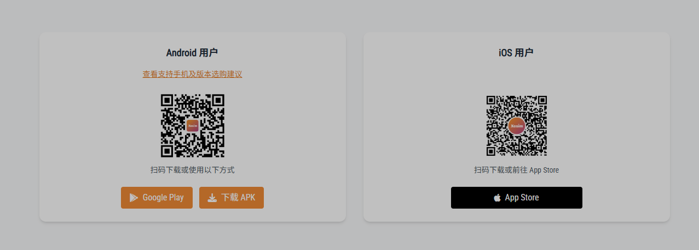
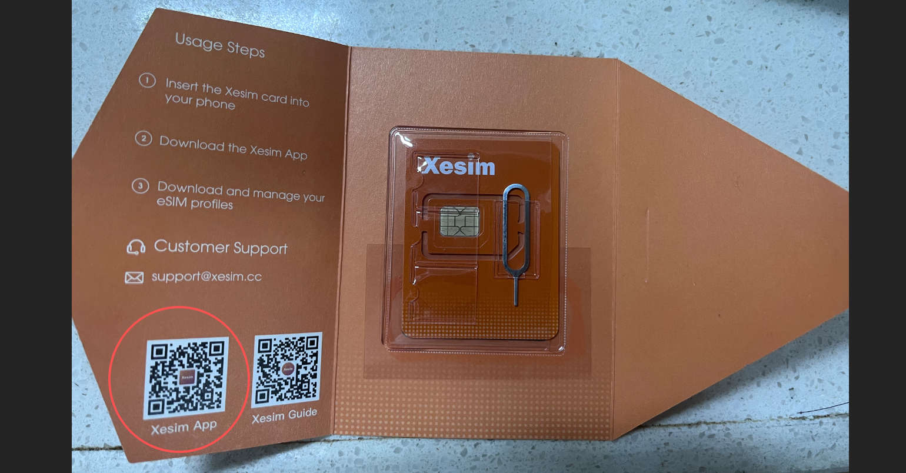

3. **扫码写卡**：在手机保持 Wi-Fi 或数据联网的状态下，打开 App 点击“添加配置”，扫描你购买的 eSIM 流量卡二维码（例如 KiteSim 的香港漫游套餐）。

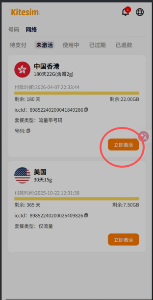
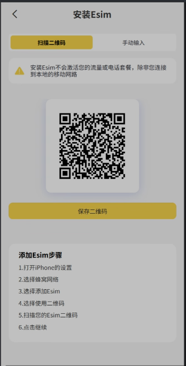

4. **立即使用**：等待约 10~30 秒，eSIM 配置文件就会直接固化进物理芯片中。在 App 列表里选中并开启该卡，手机立刻就能获得海外网络信号！

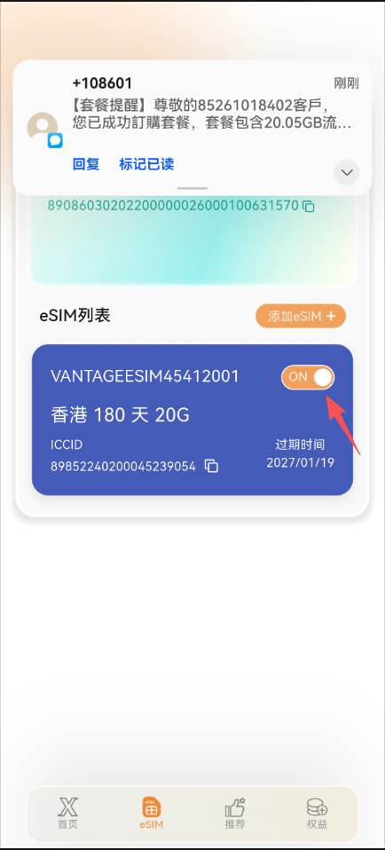

---

### 🍏 核心实操：苹果 iPhone 手机的使用方法（硬核分步解析）

因为苹果 iOS 系统严厉封杀第三方 App 对 SIM 卡底层的直接操作，在 iPhone 上使用 Xesim 必须采用特定的高阶姿势：

#### 1. X2 版（及 X1 版）iPhone 使用指南 —— “安卓换卡中转法”
如果你为了省钱买的是不含原生 STK/BIP 协议的 X2 版，你在 iPhone 上是下不了软件也写不了卡的，你必须按以下步骤利用备用机曲线救国：

* **第一步（安卓中转写卡）：** 先把 X2 芯片插进一旁备用的安卓手机里，打开 App 扫码下载并激活你的 eSIM 流量卡。
* **第二步（物理移机换卡）：** 确认在安卓机上已经下载成功并选中该卡后，用卡针把 physical 芯片拔出来，**直接插回你的 iPhone 卡槽**。
* **第三步（直接使用）：** 此时 iPhone 会把它当成一张已经被电信公司写好数据的普通 SIM 卡，直接读取并抓取网络信号，愉快上网！
* *(避坑总结：下次如果去别的国家买了新的 eSIM 包，你必须重复“拔下卡 ➔ 插进安卓写卡 ➔ 再拔下插回 iPhone”的折腾循环，极其考验耐心。)*

#### 2. X2 Pro 版 或已激活一张 eSIM 流量卡的 X1/X2 版本 iPhone 专属指南

正如前面所说，普通版 X1/X2 借用安卓机完成了第一张流量卡的激活之后（或是你直接使用了出厂自带 SeedLink 网络的 **Xesim X2 Pro**），芯片就已经具备了基础的通信能力。

从这一刻开始，你就彻底解开了苹果生态的终极封印！后续在 iPhone 上添加任何新的 eSIM 流量卡，都不再需要借用安卓机，也完全不需要下载任何第三方 App，直接依赖 iPhone 原生的**【设置 - 蜂窝网络 - SIM 卡应用程序】**（即底层 STK 菜单），通过以下 4 步即可实现“左脚踩右脚上天”的无痛直写：

1. **获取 LPA 激活字符串（关键要点）：** 
   打开手机上的**支付宝**（或任意二维码扫描工具），扫描运营商（如 kitesim）发给你的新卡 eSIM 二维码。扫码后屏幕会提取出一串以 `LPA:1$` 开头的完整字符（这在通讯协议里叫 **LPA 激活字符串 / SM-DP+ 激活码**），点击全选并复制这一整串代码。

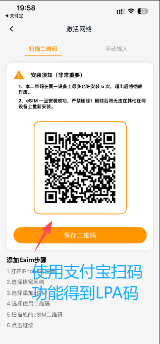
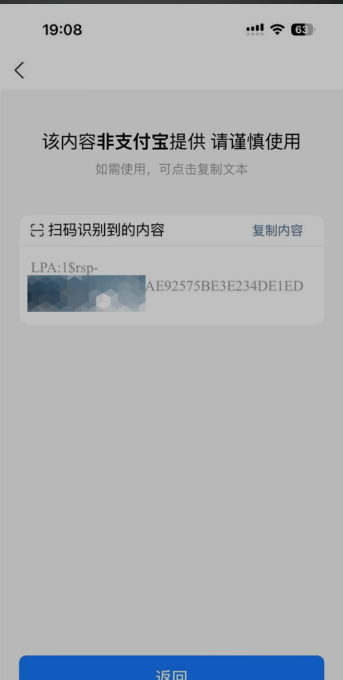

2. **进入苹果底层 STK 菜单：** 
   依次打开 iPhone 的 **【设置】 ➔ 【蜂窝网络】**，选中当前正在提供流量的那张 Xesim 卡标签。滑到最底部，点击 **【SIM 卡应用程序】**（部分 iOS 版本显示为“运营商服务”）。

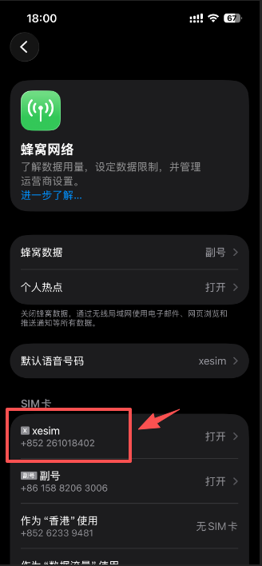
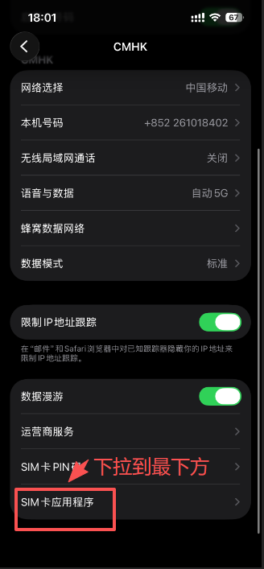

3. **粘贴代码静默下载：** 
   在芯片菜单中点击 `下载 eSIM`（Download eSIM），长按输入框，将刚刚复制的那串 **LPA 激活字符串** 粘贴进去，点击确定。此时芯片便会在后台静默连网下载，屏幕上会弹出等待处理的提示。

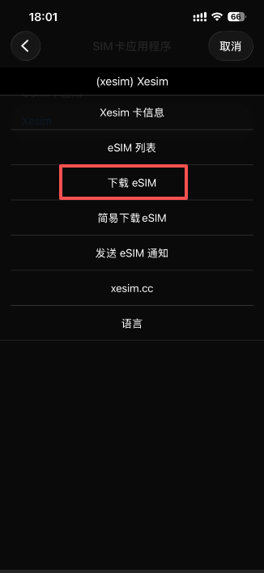
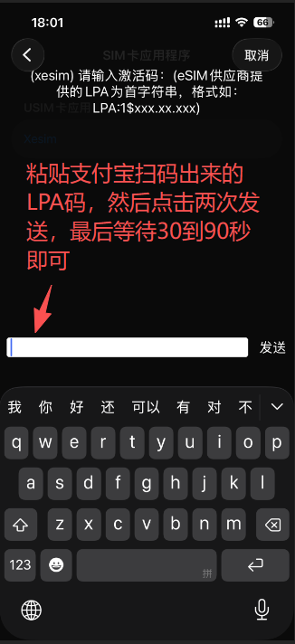

4. **一键激活启用：** 
   几秒到十几秒后，新卡空中下载完毕。在菜单中点击进入 `eSIM 列表`（Profiles），找到你刚刚下载好的全新流量卡名称，点击 `启用`（Enable/Switch），手机状态栏信号瞬间刷新，新卡直接完美连网！

---

> *(图解提示：在这里插入或制作一张“卡槽里的芯片通过自身流动的网络通道，连线云端服务器OTA固化新卡”的简单架构流程/原理图，提升硬核极客风范)*

**💡 极客硬核科普：为什么能本机直写？底层的通信黑科技是什么？**

在苹果 iOS 系统的底层通信架构中，物理 SIM 芯片通过 **BIP（承载独立协议，Bearer Independent Protocol）** 向电信运营商的远端 SM-DP+ 交付服务器发起请求时，**苹果底层强制执行一条铁律：下载数据包的流量，必须由请求芯片自身的蜂窝网络通道来承载（不能借用 Wi-Fi 或副卡流量）。**

当你切换使用当前 Xesim 里原有的旧卡流量（或是 X2 Pro 自带的 SeedLink）上网时，发起请求的硬件与承载流量的网络，在底层协议上达到了完全统一！微型芯片直接借用自己在空中流动的蜂窝数据通道，与远端服务器建立起加密隧道，将全新 eSIM 的加密配置文件直接拉回并固化到芯片内存中。

**一句话总结：你不需要向苹果系统索要任何越狱或额外的沙盒权限，而是这张智能微型芯片利用自己的联网通道，在你的 iPhone 卡槽里独立完成了一次极速的“云端自我进化”！**

---

### 🎯 终极选购建议与配置实战

千万不要因为国区手机的阉割而限制了你在全球网络畅游的自由：
* **如果只是为了搞个海外号低成本接收验证码防失联：** 直接选 **[KiteSim 加拿大 $0.3/月保号卡](https://h5.kitesim.co/register/?invite=CSZHOC)**，网页端直接收短信，一分钱硬件写卡器都不用买，绝对的省钱王者。
* **如果是安卓主力机，想长期畅享全球低价 eSIM 流量：** 直接冲 **[Xesim X2 无限写卡版](https://你的Xesim推广链接/aff)** + **[KiteSim 香港低至 $0.56/GB 漫游神卡](https://h5.kitesim.co/register/?invite=CSZHOC)**，即插即用，省心无敌。
* **如果是苹果 iPhone 主力机用户，拒绝折腾备用机：** 强烈建议闭眼直升 **[Xesim X2 Pro 旗舰神装版](https://你的Xesim推广链接/aff)**，搭配各大性价比 eSIM 流量包，让国区 iPhone 彻底获得超越行货原生的顶级跨境体验！

## 🎯 总结与选购建议

如何根据你的实际需求做出最好的选择？

1. **如果你追求“开机即上网”的极简体验：** 不想每天折腾机场节点超时、更不想因为网络被墙或 IP 被封导致用不了 AI，同时兼顾出境旅游漫游，那么这张 **完美解锁 ChatGPT 的香港流量卡** 将是你 2026 年最值得投资的主力卡。
2. **如果你是纯粹的“号码收藏家”或项目方：** 需要搞个海外号低成本收短信、注册账号、做多账号防关联，拒绝购买高昂的写卡器，请闭眼直接冲 **$0.3/月的 KiteSim 加拿大卡**。

建议在配置时，**一卡用于低成本保号绑定，一卡用于日常免翻墙高速流量与 AI 办公**，两张组合完美解决跨境网民的全部痛点！

## ⚠️ 免责声明
* 本文内容仅供技术交流，请遵守当地法律法规。