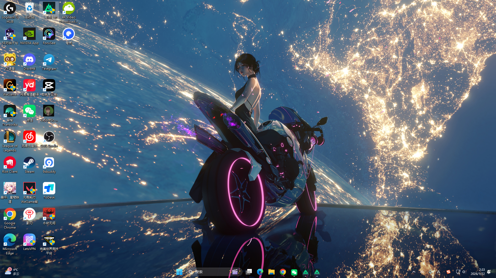

# 🎁 [【2026神卡推荐】免翻墙直连 ChatGPT/Gemini 的香港漫游神卡 vs 月付 $0.3 零成本免写卡器保号卡！] 

{ width="300" align=left style="border-radius: 8px; margin-right: 20px; box-shadow: 0 4px 10px rgba(0,0,0,0.1); margin-bottom: 10px;" }

**本期要点：** [这里简述视频的核心价值，吸引读者往下看]。本教程手把手带你通过验证，建议收藏！

  <a href="https://youtu.be/gy_Ko1CTFIU?si=Lt7sacDMXgtkBANl" target="_blank" class="md-button md-button--neutral" style="display: inline-flex; align-items: center; gap: 8px; padding: 10px 24px; font-size: 0.85rem; border-radius: 20px; text-decoration: none; font-weight: bold; border: 1px solid rgba(0,0,0,0.1); transition: all 0.3s ease;">
    <svg viewBox="0 0 576 512" style="height: 1.1em; fill: #FF0000; margin: 0; display: block;"><path d="M549.655 124.083c-6.281-23.65-24.787-42.276-48.284-48.597C458.781 64 288 64 288 64S117.22 64 74.629 75.486c-23.497 6.322-42.003 24.947-48.284 48.597-11.412 42.867-11.412 132.305-11.412 132.305s0 89.438 11.412 132.305c6.281 23.65 24.787 41.5 48.284 47.821C117.22 448 288 448 288 448s170.781 0 213.371-11.486c23.497-6.321 42.003-24.171 48.284-47.821 11.412-42.867 11.412-132.305 11.412-132.305s0-89.438-11.412-132.305zm-317.51 213.508V175.185l142.739 81.205-142.739 81.201z"/></svg>
    立即观看完整视频
  </a>

 
<!-- more -->
---

# Bitget Wallet 新 U 卡申请教程：手续费、地址证明与首刷返 5U

Bitget 已从 2026 年 8 月 1 日起，将新的 Bitget Card 申请入口逐步迁移至 Bitget Wallet。新版卡除了申请入口发生变化，也加入了 **2%～3% Assetback 资产返现**机制。

如果你通过我的邀请码申请新版 Bitget Wallet Card，并完成活动要求的首笔消费，还可以参加 **首刷返 5U** 活动。

**我的邀请码：`3vbm`**

> 活动奖励、有效期、最低消费金额和支持地区可能随时调整。申请前请在 Bitget Wallet 的活动页面确认当前显示的规则。本文不构成金融、投资或法律建议。

## 一、先确认自己是否符合申请条件

申请页面显示，中国大陆护照持有人需要根据页面选择实际居住地，并提供相应的地址证明。原申请截图中显示的材料要求包括：

- 有效护照，剩余有效期通常需要在 6 个月以上
- 最近 3 个月内出具的地址证明
- 可正常接收验证码的手机号
- 常用邮箱
- 人脸识别
- 真实的职业与收入资料

最重要的一点是：**护照只负责证明身份，地址证明负责证明你实际居住在哪里。**姓名、居住地和提交的证明文件必须真实且互相匹配。

<!-- 图片 2：申请资格页面截图。上传后建议替换为：/images/bitget-wallet-card/application-eligibility.jpg -->

> 图片内容：Bitget Wallet Card 居住地、护照有效期及地址证明要求页面。

## 二、旧卡用户需要重新创建钱包

这次是新版 Bitget Wallet Card。以前申请过旧卡的用户，需要先在 Bitget Wallet 中重新创建一个助记词钱包或 MPC 钱包，再使用新钱包申请。

操作路径：

**点击钱包名称 → 添加钱包 → 创建新钱包**

创建并备份钱包后，再进入：

**钱包 → 银行卡 → 立即申请**

这不是让你重新下载 App，而是需要在现有 Bitget Wallet 中创建一个符合新卡申请要求的钱包。

> 安全提醒：助记词等同于钱包控制权。不要截图上传网盘，也不要发送给客服、推广人员或所谓的代办。正规 KYC 不会要求你提供助记词或私钥。

## 三、注册卡片服务并填写邀请码

进入卡片页面后，输入手机号和短信验证码，阅读并勾选相关协议，然后完成注册。

<!-- 图片 3：手机号注册页面。上传后建议替换为：/images/bitget-wallet-card/register.jpg -->

> 图片内容：输入手机号、验证码并注册 Bitget Wallet Card 的页面。

如果注册页面提供邀请码输入框，可以填写：

**邀请码：`0vx666888`**

部分地区也可以在开卡后进入邀请中心补填邀请码。根据亚太地区帮助中心规则，通常需要同时满足：

- 开卡不超过 7 天
- 之前没有绑定其他邀请码
- 当前设备符合风控要求
- 邀请码一旦绑定，不能更换

因此，建议在首次申请时就完成绑定，并截图保留活动规则和绑定成功页面。

## 四、完成护照 KYC 和人脸识别

按照页面提示完成以下步骤：

1. 上传有效护照
2. 完成人脸识别
3. 上传地址证明

<!-- 图片 4：护照和人脸认证步骤图。上传后建议替换为：/images/bitget-wallet-card/kyc.jpg -->

> 图片内容：护照上传、人脸识别和 KYC 认证页面。

拍摄护照时注意：

- 护照四角完整
- 文字和照片清晰
- 避免灯光反射
- 不要裁切、涂改或添加水印遮挡关键信息
- 护照姓名应与申请资料一致

## 五、地址证明怎么准备？

地址证明是最容易出现退件的一项。常见候选文件包括：

- 银行或持牌金融机构出具的正式月结单
- 水、电、燃气或固定网络账单
- 政府部门或税务机构出具的文件
- 发卡方明确认可的其他居住证明

提交前建议检查：

- 是否为最近 3 个月内出具
- 是否显示申请人完整姓名
- 是否显示完整居住地址
- 是否显示文件日期
- 是否能识别出具机构
- 地址是否与申请页面完全一致
- 是否属于目前支持申请的国家或地区

不要购买、伪造或借用他人的地址证明。虚假材料可能导致审核失败、账户限制，并带来合规风险。

## 六、填写职业、收入并提交审核

完成身份认证和地址证明后，继续填写邮箱、行业、职业、工作年限、就业经历和年收入等信息。所有内容都应根据实际情况填写。

<!-- 图片 5：职业和收入信息页面。上传后建议替换为：/images/bitget-wallet-card/employment-and-income.jpg -->

> 图片内容：填写职业、行业、工作年限和年收入的页面。

提交之前再次检查姓名、地址、邮箱和职业资料。提交成功仅代表申请已进入审核，并不代表一定获批。

<!-- 图片 6：申请提交成功页面。上传后建议替换为：/images/bitget-wallet-card/submitted.jpg -->

> 图片内容：Bitget Wallet Card 申请提交成功页面。

审核通过后，新卡会显示在 Bitget Wallet 中。按照卡片页面提示充值后，即可进行线上或线下消费，并尝试绑定 Apple Pay、Google Pay、微信或支付宝；实际支持情况取决于卡片所属地区和发卡机构。

## 七、用邀请码申请并消费，领取 5U

本次推广活动的核心流程是：

1. 使用邀请码 `0vx666888` 申请 Bitget Wallet Card
2. 完成身份认证并成功开卡
3. 按活动页面要求完成第一笔符合条件的消费
4. 等待系统发放 5U 奖励

需要注意，Bitget 官方的新卡迁移公告确认了“首次申请用户完成首笔合格消费后获得奖励”的机制，但公开公告没有统一列出所有渠道的具体奖励金额。**5U 属于当前邀请码推广页面展示的活动权益，最终以你申请时 App 内显示的任务条件为准。**

为了避免漏掉奖励，建议：

- 开卡前确认活动页显示首刷返 5U
- 确认邀请码已经绑定成功
- 查看是否有最低消费金额
- 避免使用充值、转账、取现等通常不计入刷卡任务的交易
- 不要在奖励到账前退款或撤销消费
- 保存活动页面、邀请码绑定和首笔消费记录截图

## 八、新版卡刷卡有没有手续费？

有。新版的 **Assetback 是消费返现，不等于消费时完全不扣手续费**。

根据 Bitget Wallet 亚太地区帮助中心当前公布的费率：

- 年费：0
- 月费：0
- 卡片充值费：0
- 所有消费约收取 0.5% 的加密货币转法币费用
- 使用美元消费：不额外收取外汇费
- 使用人民币等非美元货币消费：额外收取约 1.7% 外汇兑换费
- 链上充值：需要自行支付对应网络的 Gas 费

因此，亚太卡的刷卡成本大致如下：

| 消费场景 | 预计卡片侧费用 | 默认 2% Assetback 后 | 3% Assetback 后 |
| --- | ---: | ---: | ---: |
| 美元消费 | 约 0.5% | 理论净收益约 1.5% | 理论净收益约 2.5% |
| 人民币等非美元消费 | 约 2.2% | 理论净成本约 0.2% | 理论净收益约 0.8% |

例如，用卡消费等值 100 美元的人民币：

- 加密货币转法币费约 0.5 美元
- 外汇兑换费约 1.7 美元
- 卡片侧费用合计约 2.2 美元
- 默认 2% Assetback 约返 2 美元
- 最终理论净成本约 0.2 美元

以上只是根据公布费率进行的简化测算。实际金额还会受到 Visa/Mastercard 实时汇率、交易结算时间、舍入规则、商户类别和返现上限影响。

## 九、微信和支付宝消费要注意 200 元门槛

如果把境外卡绑定微信或支付宝，单笔消费超过人民币 200 元，支付平台可能额外收取约 3% 的国际银行卡服务费。这笔费用由微信或支付宝收取，不是 Bitget 收取。

假设使用亚太卡完成一笔超过 200 元的人民币消费，理论成本可能是：

- Bitget 卡片侧费用约 2.2%
- 微信或支付宝服务费约 3%
- 总费用约 5.2%
- 扣除默认 2% Assetback 后，净成本仍约 3.2%
- 即使获得 3% Assetback，净成本仍约 2.2%

因此，通过微信或支付宝使用时，单笔不超过 200 元通常更有利；但不要为了规避平台规则而刻意拆单，支付是否成功及费用仍以支付页面提示为准。

## 十、2%～3% Assetback 怎么计算？

从 2026 年 8 月 1 日开始，新版 Bitget Wallet Card 将消费权益升级为资产返现：

- 所有持卡用户默认享受 2% Assetback
- 新用户或当月消费达到指定门槛，可进入 Booster 档，最高 3%
- Booster 权益在达标当月和下一个自然月生效
- 每个自然月可修改一次返现资产
- 奖励通常在消费后实时显示，交易完成 T+7 后开放领取

可选择的返现资产包括：

- BTC
- 代币化黄金
- 英伟达
- 特斯拉
- 谷歌
- 标普 500 ETF
- USDC

选择 USDC 时，奖励会发放至卡片余额；选择其他资产时，累计奖励价值达到 1 USDC 后才能提取到奖励账户。

以下交易可能无法获得 Assetback：

- 退款、撤销或取消的消费
- 官方排除的 MCC 商户类别
- 未通过风控审核的交易
- 超出每月奖励上限的部分

具体 Booster 门槛、每月返现上限和排除商户，应以 Bitget Wallet App 的 Assetback 页面为准。

## 十一、常见问题

### 中国护照可以申请吗？

是否可以申请不只取决于护照，还取决于当前支持地区、实际居住地和地址证明。请以 App 为你展示的地区选项为准，并提交真实资料。

### 申请时必须存入 10 美元吗？

不同版本和地区的 Bitget Wallet Card 规则不完全相同。部分中国大陆旧卡帮助页面曾要求钱包持有不少于 10 美元等值资产，但这属于余额资格要求，不是永久扣除的开卡费。新版申请是否仍要求持有 10 美元，应以你的申请页面为准。

### 首刷多少金额才能获得 5U？

公开公告没有统一列出所有邀请渠道的最低金额。必须查看邀请码活动页显示的“合格消费”条件。不要默认任意金额消费都一定符合要求。

### 2% 返现能完全覆盖手续费吗？

美元消费通常可以覆盖约 0.5% 的卡片侧费用；人民币等非美元消费的卡片侧费用约为 2.2%，默认 2% 返现只能基本抵消。通过微信或支付宝完成超过 200 元的交易时，还可能产生额外 3% 平台服务费。

## 总结

新版 Bitget Wallet Card 的申请流程可以概括为：

**创建新钱包 → 注册卡片服务 → 绑定邀请码 → 护照与人脸认证 → 上传地址证明 → 填写职业和收入 → 提交审核 → 开卡并完成首笔合格消费。**

本次值得关注的权益包括：

- 使用邀请码 `0vx666888`，完成活动要求后领取 5U 首刷奖励
- 日常符合条件的消费默认获得 2% Assetback
- 新用户或达到消费门槛后最高可获得 3% Assetback
- 可以选择 BTC、黄金、美股、ETF 或 USDC 作为返现资产
- 虚拟卡免年费和月费

但新版卡并不是所有场景都完全免费。亚太卡美元消费约有 0.5% 转换成本，非美元消费的卡片侧费用合计约 2.2%；微信和支付宝超过 200 元的交易还可能额外产生 3% 平台手续费。

申请和消费之前，请务必在 Bitget Wallet App 中再次核对活动期限、支持地区、手续费、返现上限和首刷任务条件。

## 参考资料

- [Bitget Card 申请入口迁移至 Bitget Wallet](https://www.bitget.com/support/articles/12560603889935)
- [Bitget Wallet Card Assetback 资产返现说明](https://web3.bitget.com/zh-CN/blog/articles/bitget-wallet-card-assetback)
- [Bitget Wallet Card 亚太地区费用说明](https://web3.bitget.com/zh/helpCenter/431)
- [Bitget Wallet Card 亚太地区邀请码规则](https://web3.bitget.com/zh-CN/helpCenter/478)
- [原始 X 图文](https://x.com/0vx888/status/2083271118249730451)

---

本文由 YouTube 频道「加密 Chris Talk」整理。邀请码推广可能使发布者获得平台奖励，不会承诺申请一定通过或奖励一定到账；具体规则以 Bitget Wallet 官方页面为准。
