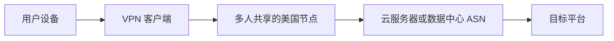
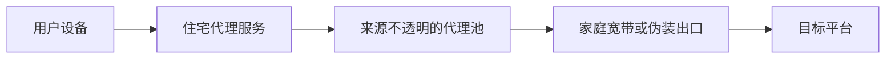
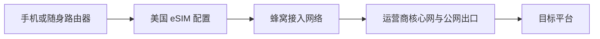

# 🎁 [【2026神卡推荐】免翻墙直连 ChatGPT/Gemini 的香港漫游神卡 vs 月付 $0.3 零成本免写卡器保号卡！] 

{ width="300" align=left style="border-radius: 8px; margin-right: 20px; box-shadow: 0 4px 10px rgba(0,0,0,0.1); margin-bottom: 10px;" }

**本期要点：** [这里简述视频的核心价值，吸引读者往下看]。本教程手把手带你通过验证，建议收藏！

<div style="margin-top: 25px; text-align: center;">
  <a href="https://youtu.be/gy_Ko1CTFIU?si=Lt7sacDMXgtkBANl" target="_blank" class="md-button md-button--neutral" style="display: inline-flex; align-items: center; gap: 8px; padding: 10px 24px; font-size: 0.85rem; border-radius: 20px; text-decoration: none; font-weight: bold; border: 1px solid rgba(0,0,0,0.1); transition: all 0.3s ease;">
    <svg viewBox="0 0 576 512" style="height: 1.1em; fill: #FF0000; margin: 0; display: block;"><path d="M549.655 124.083c-6.281-23.65-24.787-42.276-48.284-48.597C458.781 64 288 64 288 64S117.22 64 74.629 75.486c-23.497 6.322-42.003 24.947-48.284 48.597-11.412 42.867-11.412 132.305-11.412 132.305s0 89.438 11.412 132.305c6.281 23.65 24.787 41.5 48.284 47.821C117.22 448 288 448 288 448s170.781 0 213.371-11.486c23.497-6.321 42.003-24.171 48.284-47.821 11.412-42.867 11.412-132.305 11.412-132.305s0-89.438-11.412-132.305zm-317.51 213.508V175.185l142.739 81.205-142.739 81.201z"/></svg>
    立即观看完整视频
  </a>
</div>

<br clear="left">
<!-- more -->
---

做 TikTok Shop、Amazon 美国站、Shopify 独立站或海外广告投放时，很多人的第一反应是：

> 只要连接一个美国 VPN，让检测网站显示“United States”，网络环境不就解决了吗？

真正使用一段时间后，问题往往才暴露出来：同一条线路重新连接一次，IP 从纽约跳到洛杉矶；宣传为“住宅 IP”的代理，检测结果却显示为机房或托管网络；有些美国流量 eSIM 虽然能连接美国运营商基站，公网出口却不一定在美国。

所以，判断一条线路是否适合长期跨境运营，不能只看国旗和城市名称。

!!! info "先说结论"
    * **美国 IP 不等于美国真实用户网络。** 国家只是最表层的信息，还要看 ASN、ISP、网络类型和出口路径。
    * **住宅 IP 不等于独享、固定或历史干净。** 它可能来自轮换代理池，也可能被多人使用。
    * **eSIM 不天然等于美国本地出口。** eSIM 只是数字化 SIM 形态，最终要看实际运营商和公网出口。
    * **移动网络也不等于永久固定 IP。** 更值得关注的是运营商、ASN、国家/区域和使用路径能否长期保持一致。
    * **任何网络都不能保证账号安全。** 平台还会结合设备、浏览器、登录行为和账号历史等信息进行判断。

---

## 🧭 “IP 纯净度”到底是什么？

“纯净 IP”“原生 IP”“高权重 IP”更多是行业营销语言，并没有一个所有平台通用的官方评分标准。

对普通用户来说，可以把大家常说的 **IP 纯洁性或纯净度** 拆成下面六个可验证维度：

| 检测维度 | 需要看什么 | 常见误区 |
| :--- | :--- | :--- |
| **国家与地区** | Country、Region、City | 显示美国就认为万事大吉 |
| **ASN 与 ISP** | 网络由谁持有和对外广播 | 只看 ISP 名字，不看 ASN 类型 |
| **网络类型** | Mobile、ISP、Hosting、Datacenter | 把所有“非机房”都叫住宅 IP |
| **共享情况** | 是否为公共节点、代理池或 CGNAT 出口 | 把住宅/移动网络误解成一人一 IP |
| **环境一致性** | 重连后国家、区域、ASN 是否大幅变化 | 只测试一次就下结论 |
| **历史与信誉** | 多个检测库是否标记 VPN、Proxy、Hosting 或 Abuse | 迷信单一网站的 Fraud Score |

!!! warning "一个很重要的边界"
    第三方检测网站只能提供线索，不能证明某个 IP “100% 干净”。不同数据库的更新时间、分类方法和地理定位可能不同，最好交叉查看两到三个结果。

---

## 🖥️ 普通 VPN：显示美国，但可能仍是机房环境

VPN 的主要价值是加密传输、保护隐私和快速切换地区。对于浏览网页、观看内容或短期测试，它通常依然是最方便、性价比最高的选择。

但很多低价或公共 VPN 使用的是数据中心服务器：



### 问题一：同一个出口可能被很多人共享

公共 VPN 为了降低成本，常常让大量用户共用有限的公网出口。你无法知道其他用户之前使用这个地址做过什么，也无法控制它在不同服务中的历史记录。

这不代表共享 IP 一定有问题，但它会增加环境的不确定性。

### 问题二：ASN 一眼就能看出是托管网络

有些节点的页面显示：

```text
Country: United States
City: New York
```

但继续往下看，可能是：

```text
ASN Type: Hosting
Organization: Cloud / VPS Provider
```

这类地址确实位于美国，却更像服务器出口，而不是家庭宽带或手机用户的日常网络。

### 问题三：重连后 IP 和城市容易变化

如果客户端采用自动选线或负载均衡，同一个“美国节点”在不同时间可能被分配到不同机房。上午显示纽约，下午变成芝加哥，重启后又跳到洛杉矶。

对于长期使用的运营设备，真正需要避免的不是“IP 必须一辈子不变”，而是 **国家、城市、时区、ASN 和设备环境一起频繁漂移**。

---

## 🏠 住宅 IP：名字好听，但最考验供应商透明度

听到“住宅 IP”，很多人会自然理解为：

> 美国真实家庭宽带、一个人独享、长期固定，而且历史非常干净。

实际上，这四件事并不能画等号。



### 1. Residential 标签不代表独享

一个地址可能属于家庭宽带运营商，但仍然被放进轮换代理池，由不同客户在不同时间使用。网络归属是住宅，不代表使用权是独享。

### 2. 静态不一定真的固定

部分产品所说的“静态”，只是一个会话期间不轮换；断线、到期或服务商调度后，地址仍可能改变。购买前应问清楚：

* 是固定会话，还是长期固定出口？
* 是独享，还是多人分时使用？
* 能否保持同一州、城市和 ASN？
* 断线或重启后是否重新分配？

### 3. 检测数据库可能互相打架

同一个 IP 在网站 A 里显示 Residential，在网站 B 里可能显示 ISP，在网站 C 里又被标记为 Proxy。IP 数据库本身有延迟，所以单张检测截图无法证明全部事实。

### 4. 只看到 AT&T，不足以证明是 AT&T 移动网络

AT&T 旗下同时存在移动、固定宽带和企业网络资源。检测页里的 Organization 出现 AT&T，只能说明某个数据库把地址归到了相关组织；还要继续看：

* 完整 ASN 编号和名称；
* ASN Type 是 ISP、Mobile 还是 Hosting；
* 是否被识别为 VPN、Proxy 或 Hosting；
* 多次重连后 ASN 与出口地区是否一致。

---

## 📱 美国运营商 eSIM：优势不在“永不换 IP”，而在网络身份更一致

eSIM 本质上是下载到手机里的数字 SIM 配置。真正决定公网环境的，是它背后的运营商、漫游关系、核心网路由和互联网出口。



这也是为什么不能只看商品标题里的“美国 eSIM”。有些旅行 eSIM 虽然在美国连接 AT&T、T-Mobile 或 Verizon 的基站，流量仍可能被送到其他国家或地区统一出网。

如果一张 eSIM 实测满足以下条件，它才有资格被宣传为更适合长期美国网络需求：

* 公网 IP 国家持续显示为美国；
* ASN 与 ISP 信息可解释，并且多家数据库结果基本一致；
* 飞行模式、重启和跨时段测试后，运营商与出口区域没有大幅漂移；
* 没有同时叠加 VPN、代理或异常 DNS，网络路径更简单；
* 主要在同一台设备、同一套系统环境中长期使用。

### KiteSIM 美国 eSIM 真正值得测试的卖点

供应方对这张卡的描述是 **美国 AT&T 相关网络出口**。但在正式写成“AT&T 移动 IP”“住宅 IP”或“稳定美国 IP”之前，仍然应该用实际数据说话。

<!--
发布前请把下表中的“待实测”替换为你的真实结果，并补充相应截图。
不要在截图中公开完整 IP，可遮住最后一段。
-->

| KiteSIM 实测项目 | 本次结果 |
| :--- | :--- |
| **公网国家/地区** | 待实测：例如 United States / 州 / 城市 |
| **ISP / Organization** | 待实测：例如 AT&T 相关组织名称 |
| **ASN** | 待实测：填写 AS 编号与完整名称 |
| **网络分类** | 待实测：Mobile / ISP / Residential / Hosting |
| **VPN / Proxy 检测** | 待实测：列出两个检测库的结果 |
| **飞行模式重连后** | 待实测：IP 是否变化，ASN 与州是否保持一致 |
| **连续使用 7 天** | 待实测：掉线次数、区域漂移次数、平均延迟 |
| **热点共享** | 待实测：是否支持、共享后的出口是否一致 |

<!-- 实测后将图片保存到对应路径，并取消下面两行的注释。 -->
<!--  -->
<!--  -->

!!! tip "更准确的宣传方式"
    如果实测发现公网 IP 会变化，不要把它包装成“永久固定 IP”。更可信的说法是：**多次重连后仍保持美国运营商 ASN 和相近出口区域，网络身份比随机切换的公共节点更一致。**

---

## 🧪 我建议这样做一次 7 天稳定性测试

一次检测只能确认当时的出口。要验证“稳定性”，至少连续记录 7 天。

### 第一步：关闭所有干扰项

* 关闭 VPN、代理软件和 iCloud Private Relay 等额外转发服务；
* 关闭 Wi-Fi，确认手机正在使用 KiteSIM 蜂窝数据；
* 确认系统时间、时区和地区设置符合你的正常使用场景；
* 不要为了得到漂亮结果而反复切换检测工具或节点。

### 第二步：使用多个数据库交叉验证

建议记录：

1. **IPinfo**：国家、地区、ASN、Organization、Hosting/Mobile 等分类；
2. **MaxMind 或同类 GeoIP 数据库**：交叉验证国家与城市；
3. **Cloudflare Trace**：快速确认出口国家和网络连接信息；
4. **DNS / WebRTC 检测**：观察是否出现与公网出口冲突的地址；
5. **Speedtest**：记录延迟、下载、上传和抖动。

### 第三步：主动制造网络重连

分别测试：

* 开关飞行模式；
* 重启手机；
* 间隔数小时重新连接；
* 使用手机热点连接电脑；
* 在早、中、晚三个时段重复检测。

### 第四步：用表格记录，不要凭感觉

| 时间/操作 | IP 前缀（打码） | 国家/州 | ASN | ISP/类型 | 延迟 | 备注 |
| :--- | :--- | :--- | :--- | :--- | :--- | :--- |
| Day 1 上午 | `xxx.xxx.*.*` | 待填写 | 待填写 | 待填写 | 待填写 | 初次连接 |
| Day 1 飞行模式后 | `xxx.xxx.*.*` | 待填写 | 待填写 | 待填写 | 待填写 | 观察是否换 IP |
| Day 3 重启后 | `xxx.xxx.*.*` | 待填写 | 待填写 | 待填写 | 待填写 | 观察 ASN/州 |
| Day 7 | `xxx.xxx.*.*` | 待填写 | 待填写 | 待填写 | 待填写 | 汇总结论 |

这里最值得关注的不是每一位 IP 数字都不变，而是：

> 即使公网地址发生动态分配，国家、州、运营商 ASN 和网络类型是否仍然保持在一个可解释、相对一致的范围内。

移动运营商常使用地址共享或运营商级 NAT。多个用户共享公网 IPv4 并不稀奇，因此“移动网络”不能被宣传成“一人独享一个公网 IP”。

---

## 📊 VPN、住宅 IP 与美国 eSIM 全面对比

| 对比项目 | 普通 VPN | 住宅代理 | 经实测合格的美国运营商 eSIM |
| :--- | :--- | :--- | :--- |
| **常见出口类型** | 数据中心/托管网络 | 家庭宽带或代理池 | 蜂窝运营商/ISP 出口 |
| **是否可能共享** | 常见 | 可能 | 可能存在运营商级共享地址 |
| **IP 是否会变化** | 重新连接时常变化 | 取决于静态或轮换方案 | 可能动态变化 |
| **ASN/区域一致性** | 自动选线时可能漂移 | 取决于供应商 | 合格线路通常更容易保持运营商和区域一致 |
| **部署难度** | 低 | 中，需要配置代理 | 低，安装后使用蜂窝数据 |
| **适合设备** | 电脑和手机 | 浏览器、指纹环境或指定应用 | 手机、平板、随身路由器及热点设备 |
| **主要优势** | 便宜、灵活、切换快 | 可选择城市和会话策略 | 网络路径简单，更接近日常移动接入方式 |
| **主要风险** | 共享节点、机房 ASN、频繁跳点 | 来源与独享性难核验 | 套餐成本、动态 IP、漫游出口可能与宣传不一致 |

### 按需求选择，而不是盲目追求“最高级”

=== "✅ 普通访问与临时测试"
    VPN 更方便，也更便宜。没有必要为了看网页或临时访问购买复杂网络方案。

=== "✅ 需要特定城市或浏览器代理"
    可以选择信息透明、支持长期会话的住宅代理，但要核验 ASN、独享方式和轮换规则。

=== "✅ 长期使用手机运营美国业务"
    如果 KiteSIM 实测为美国运营商出口，并能长期保持 ASN 与区域一致，它更适合作为固定手机上的日常蜂窝网络方案。

=== "❌ 需要公网固定 IP 或入站连接"
    普通移动 eSIM 通常不适合作为固定公网服务器线路。需要 IP 白名单、远程入站或端口映射时，应选择明确提供独享静态 IP 的商业网络服务。

---

## 🛡️ 网络环境稳定，不等于可以忽略其他因素

即使 IP 检测结果很好，也不要把全部注意力放在网络上。长期运营账号时，还应该保持：

* 尽量使用固定的主设备和浏览器环境；
* 不要在短时间内跨国家、跨州频繁切换线路；
* 系统时区、语言、定位权限与实际业务场景保持合理一致；
* 不要同时叠加多层 VPN、代理和远程桌面；
* 账号资料、支付信息与登录行为遵守平台规则；
* 对重要账号启用双重验证，并保存恢复方式。

!!! danger "不要宣传这些话"
    * “用了绝对不会封号”
    * “100% 绕过平台风控”
    * “永久固定、完全独享”——除非产品合同和长期测试能够证明
    * “所有住宅 IP 都是假的”或“所有 VPN 都不能用”

更专业、也更能建立信任的表达是：

> 这张卡的价值不是承诺消灭风险，而是通过可复现的检测，减少公共节点、机房 ASN 和频繁跨区切换带来的环境不确定性。

---

## 🎯 KiteSIM 美国 eSIM 适合哪些人？

### 更适合

* 长期使用固定手机管理 TikTok Shop、Amazon 美国站或 Shopify 店铺的运营者；
* 需要在手机端处理海外社媒、客服和广告后台的团队；
* 希望减少 VPN 自动跳点和多层代理配置的人；
* 愿意先检测 ASN、ISP 与出口地区，再决定是否长期使用的人。

### 不一定适合

* 只想短期浏览网页、看视频的普通用户；
* 必须使用永久固定公网 IP 或 IP 白名单的企业系统；
* 追求超大流量下载、游戏低延迟或固定宽带替代的人；
* 试图通过网络工具违反平台规则、批量操控账号的人。

---

## 🔗 KiteSIM 体验入口

如果你也想测试美国运营商 eSIM，可以先通过下面的入口查看当前套餐，再按照本文的方法核对 IP，而不是只看商品页上的宣传词。

> **👉 KiteSIM 注册及套餐入口：** **[点击这里查看 KiteSIM](https://h5.kitesim.co/register/?invite=CSZHOC)**  
> **专属邀请码：** `CSZHOC`

!!! note "推广关系说明"
    上述链接包含作者的邀请码。你通过链接注册或购买时，作者可能获得推广收益，但不会因此增加你的订单价格。本文判断以公开原理和实际检测结果为准；套餐价格、运营商及出口线路可能调整，请以下单页面和当次实测为准。

---

## ✅ 最后的购买建议

如果只是偶尔访问海外网站，普通 VPN 已经足够；如果需要精确选择城市，可以研究信息透明的住宅代理；如果你的核心场景是在一台固定手机上长期处理美国业务，那么 **经过实测、能保持美国运营商 ASN 与出口区域相对一致的 eSIM**，会是更省心的方案。

但无论选择哪一种，都请记住：

> 不要购买“美国”两个字，要购买一套能够被验证、能够长期复测、出现问题时能够解释的网络环境。

这才是 KiteSIM 美国 eSIM 最值得展示的地方，也是比“纯净 IP”“防封神卡”更可信、更长久的推广方式。

---

## 📚 参考资料

* [AT&T：eSIM 是连接设备与移动网络的数字 SIM](https://www.att.com/support/how-to/prepaid/esim-get-started/)
* [IETF RFC 6598：运营商级 NAT 与共享地址空间](https://datatracker.ietf.org/doc/html/rfc6598)
* [IETF RFC 6269：IP 地址共享带来的技术问题](https://datatracker.ietf.org/doc/html/rfc6269)
* [MaxMind：IP 地理定位具有天然误差](https://dev.maxmind.com/geoip/docs/web-services/)
* [IPinfo：ASN、Hosting、Mobile 与隐私分类示例](https://ipinfo.io/developers/code-snippets)
* [Cloudflare：代理出口与地理位置匹配的重要性](https://developers.cloudflare.com/privacy-proxy/concepts/geolocation/)

## ⚠️ 免责声明

* 本文内容仅供网络技术交流与合规业务参考，不构成平台风控规避建议。
* IP 数据库结果会随时间更新，文章中的实测结论只代表测试当时的网络状态。
* 请遵守所在地法律法规、运营商条款及所使用平台的服务规则。
