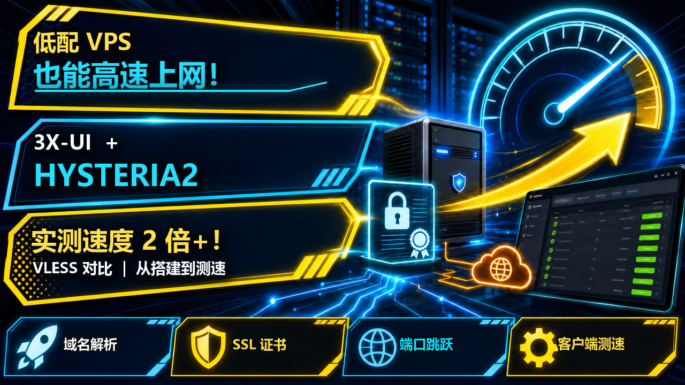
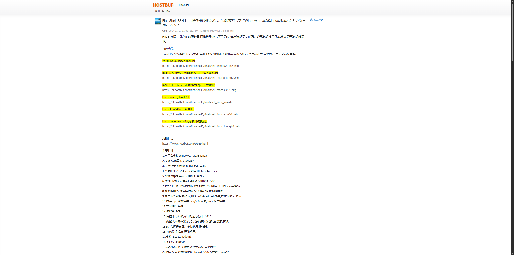
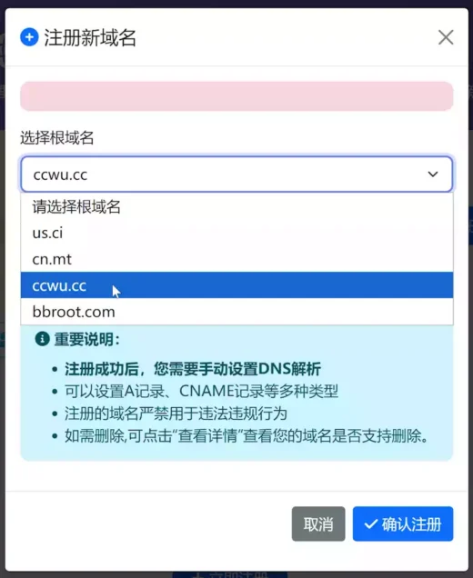
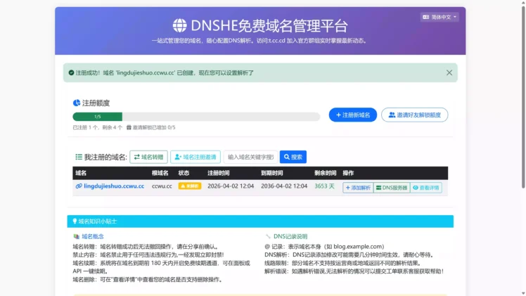
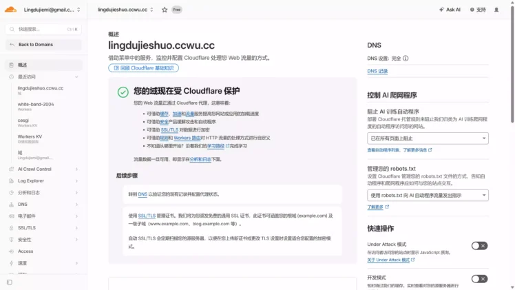

# 🌍【2026新版】X-UI + Cloudflare SSL + Hysteria2 节点搭建教程

{ width="300" align=left style="border-radius: 8px; margin-right: 20px; box-shadow: 0 4px 10px rgba(0,0,0,0.1); margin-bottom: 10px;" }

<div style="margin-top: 25px; text-align: center;">
  <a href="https://youtu.be/JYh8jL9AjSA?si=hk6YPhHbYu3Hzkbl" target="_blank" class="md-button md-button--neutral" style="display: inline-flex; align-items: center; gap: 8px; padding: 10px 24px; font-size: 0.85rem; border-radius: 20px; text-decoration: none; font-weight: bold; border: 1px solid rgba(0,0,0,0.1); transition: all 0.3s ease;">
    <svg viewBox="0 0 576 512" style="height: 1.1em; fill: #FF0000; margin: 0; display: block;"><path d="M549.655 124.083c-6.281-23.65-24.787-42.276-48.284-48.597C458.781 64 288 64 288 64S117.22 64 74.629 75.486c-23.497 6.322-42.003 24.947-48.284 48.597-11.412 42.867-11.412 132.305-11.412 132.305s0 89.438 11.412 132.305c6.281 23.65 24.787 41.5 48.284 47.821C117.22 448 288 448 288 448s170.781 0 213.371-11.486c23.497-6.321 42.003-24.171 48.284-47.821 11.412-42.867 11.412-132.305 11.412-132.305s0-89.438-11.412-132.305zm-317.51 213.508V175.185l142.739 81.205-142.739 81.201z"/></svg>
    立即观看完整视频
  </a>
</div>

<br clear="left">
<!-- more -->
---

## 🔥 一、本期视频同款配置

### 1. VPS 服务器

- 👉 **本期视频同款 VPS（搬瓦工基础机）**：[点击跳转](https://bwh81.net/aff.php?aff=82013&pid=44)

- 📖 **其他服务器（VPS）实测推荐**：[点击查看详情](https://lanyun122.github.io/blog/recommend/1-vps/)

## 2. 静态住宅 IP

- 👉 **本期视频同款静态 IP（Webshare）**：[点击跳转](https://www.webshare.io/?referral_code=lq6qy4n0ui6c)

- 💳 **国际虚拟卡申请教程：**

  [▶️ Bybit U卡（台湾）](https://partner.bybit.com/b/148332)　[▶️ Bybit U卡（哈萨克斯坦）](https://partner.bybit.com/b/148332)
---

## 3. 账号合租平台
**🚌 环球巴士 · 借个号（短期会员租赁推荐）（付款输入“lanyun”可再打9折）**：[点击跳转](https://universalbus.cn?s=fpoRdmZCPZ)

---

# 🛠️ 二、配套软件与工具

- FinalShell 官方网站：[点击下载](https://www.hostbuf.com/t/988.html)

- V2rayN（Windows 电脑版）**：[点击下载](https://github.com/2dust/v2rayN)

- V2rayNG（Android 手机版）**：[点击下载](https://github.com/2dust/v2rayNG)

- Clash Verge Rev（Windows 电脑版）**：[点击下载](https://github.com/Clash-Verge-rev/clash-verge-rev/releases/latest?utm_source=chatgpt.com)

- Clash Meta for Android（Android 手机版）**：[点击下载](https://github.com/MetaCubeX/ClashMetaForAndroid/releases/latest?utm_source=chatgpt.com)

- 网络测速工具：[点击使用](https://www.speedtest.net/)

- IP 信息检测：[点击使用](https://www.ip2location.com/)

- 交流群：[点击加入](https://telegram.me/+BwyeTrhg9NQ5MjVl)

---

# 🔗 三、独享节点（VPN）搭建

## 1. 服务器远程连接工具

**FinalShell：**[点击进入官方网站](https://www.hostbuf.com/t/988.html)

## 2. 3X-UI 一键部署命令

在 FinalShell 中复制并执行下面的命令：

固定安装 3X-UI v3.6.0（与本教程版本保持一致）
```bash
bash <(curl -Ls https://raw.githubusercontent.com/mhsanaei/3x-ui/master/install.sh) v3.6.0
```

> 📋 **上方是视频中用到的软件及相关网址**
>
> 💗 饮水思源，感谢 3X-UI 原作者 **mhsanaei** 的开源奉献！
>
> ➡️ **3X-UI 官方原项目地址：**[点击进入](https://github.com/mhsanaei/3x-ui)

---

本篇直接进入实际操作，完整流程：

```text
FinalShell 连接 VPS
→ 安装 3X-UI
→ 域名托管 Cloudflare
→ 域名解析到 VPS
→ 配置 SSL
→ 创建 Hysteria2 节点
```

---

# 第一步：使用 FinalShell 连接 VPS，并安装 3X-UI

FinalShell 是一款支持 SSH 和 SFTP 的服务器管理工具，我们主要使用它连接 VPS 并执行 Linux 命令。

**FinalShell 官网：**

```text
https://www.hostbuf.com/t/988.html
```

Windows版本下载：
```text
https://dl.hostbuf.com/finalshell3/finalshell_windows_x64.exe
```

安装完成后打开 FinalShell：

```text
连接管理器
→ 新建连接
→ SSH连接
```

填写 VPS 信息：

```text
主机：VPS 公网 IP
端口：22
用户名：root
密码：VPS Root 密码
```

连接成功后，可以先输入：

```bash
whoami
```

返回：

```text
root
```

说明当前已经获得 Root 权限。

然后执行 3X-UI 官方一键安装命令：

```bash
bash <(curl -Ls https://raw.githubusercontent.com/mhsanaei/3x-ui/master/install.sh) v3.6.0
```

按照安装程序提示完成配置。（可以直接无脑回车）

安装结束后重点保存：

```text
Username
Password
Web Port
Web Base Path
```

之后随时可以通过：

```bash
x-ui
```

重新进入 3X-UI 管理菜单。

> **注意：命令是 `x-ui`，不是 `3x-ui`。**

安装成功后，先使用安装程序给出的地址测试面板：

```text
http://VPS-IP:面板端口/WebBasePath/
```

例如：

```text
http://104.xxx.xxx.xxx:2053/abc123/
```

能够进入面板，就说明 3X-UI 安装成功。

**技术知识：3X-UI 是什么？**

3X-UI 本身可以理解为一个可视化管理面板，真正负责节点连接和数据传输的是底层的 Xray-core。

因此：

```text
3X-UI
= 管理界面

Xray-core
= 实际处理节点连接和流量
```

我们后面创建 VLESS、Trojan、Hysteria2 等节点，本质上都是通过 3X-UI 生成并管理 Xray 配置。

---

# 第二步：将域名托管到 Cloudflare，并解析到 VPS


1. **[第一步]**：

为了后续申请 SSL，我们需要先准备一个域名，并让这个域名解析到当前 VPS。注册一个永久免费的域名，下方就是视频所示的免费域名注册链接：

免费域名注册网站：[点击跳转](https://www.dnshe.com/)


注册登入以后，即可注册5个永久免费的域名，根域名选择ccwu.cc 或者 us.ci 都是完全免费的！




2. **[第二步]**：

注册并登入 Cloudflare 平台，然后将上方注册的免费域名托管进去

[点击跳转](https://www.cloudflare.com/)




进入 Cloudflare 后添加自己的域名。

Cloudflare 会分配两条 Nameserver，例如：

```text
xxxx.ns.cloudflare.com
yyyy.ns.cloudflare.com
```

回到购买或申请域名的平台，把原来的 NS 修改成 Cloudflare 提供的两条 Nameserver。

等待 Cloudflare 中域名状态变成：

```text
活动
```

说明域名已经成功托管到 Cloudflare。

接下来进入：

```text
Cloudflare
→ 选择域名
→ DNS
→ Records
→ Add Record
```

建议单独创建一个用于 3X-UI 的子域名。

例如主域名：

```text
example.com
```

创建：

```text
xui.example.com
```

DNS 记录填写：

```text
Type：A

Name：xui

IPv4 address：你的 VPS 公网 IP

Proxy Status：DNS Only

TTL：Auto
```

最终结构：

```text
xui.example.com
        ↓
Cloudflare DNS
        ↓
VPS 公网 IP
```

前期建议 Cloudflare 保持：

```text
DNS Only
```

也就是灰色云朵。

这样域名只是负责 DNS 解析，不让 Cloudflare 参与实际连接，方便后面排查端口、SSL 和 Hysteria2 的 UDP 连接。

配置完成后，Windows 打开 CMD：

```bash
nslookup xui.example.com
```

如果返回的 IP 与 VPS 公网 IP 一致：

```text
Name: xui.example.com
Address: 104.xxx.xxx.xxx
```

说明解析已经成功。

**技术知识：域名和 SSL 是什么关系？**

域名解析解决的是：

```text
xui.example.com
        ↓
104.xxx.xxx.xxx
```

也就是“这个域名到底对应哪台服务器”。

SSL 解决的则是：

```text
浏览器
↕ 加密传输
VPS
```

因此必须先完成域名解析，再给这个域名申请 SSL。

---

# 第三步：通过 3X-UI 给域名配置 SSL

完成 Cloudflare 域名解析后，可以使用 3X-UI 内置的 SSL 管理功能申请证书。

本教程使用的是：

```text
HTTP 验证
```

因此不需要创建 Cloudflare API Token，但需要满足以下条件：

```text
域名已经解析到当前 VPS
Cloudflare 代理状态为 DNS Only（灰色云朵）
VPS 的 TCP 80 端口可以从公网访问
TCP 80 端口没有被其他程序占用
```

如果必须保持 Cloudflare 代理，或者服务器无法开放 TCP 80，则应改用 3X-UI 的 Cloudflare SSL 功能，并配置 Cloudflare API Token，不适合继续使用本节方法。

## 1. 打开 3X-UI 管理菜单

重新打开 FinalShell，连接 VPS 后输入：

```bash
x-ui
```

回车进入 3X-UI 管理菜单。

我使用的版本中，SSL 管理对应：

```text
20. SSL Certificate Management
```

输入：

```text
20
```

然后回车。

> 不同版本的菜单编号可能发生变化。如果你的编号不是 `20`，请以菜单中的 `SSL Certificate Management` 名称为准。

## 2. 申请域名 SSL 证书

进入 SSL 管理界面后，会看到类似以下选项：

```text
1. Get SSL (Domain)
2. Revoke & Remove
3. Force Renew
4. Show Existing Domains
5. Set Cert paths for the panel
6. Get SSL for IP Address (6-day cert, auto-renews)
0. Back to Main Menu
```

这里选择：

```text
1. Get SSL (Domain)
```

输入：

```text
1
```

然后回车。

根据提示输入已经解析到当前 VPS 的完整域名，例如：

```text
xui.example.com
```

这里只填写域名本身，不要添加：

```text
https://
端口
Web Base Path
斜杠
```

正确示例：

```text
xui.example.com
```

错误示例：

```text
https://xui.example.com
xui.example.com:2053
xui.example.com/abc123/
```

如果终端显示：

```text
Existing certificate found for xui.example.com, will reuse it.
```

表示服务器上已经存在这个域名的证书，脚本将继续使用现有证书，这是正常现象。

## 3. 选择证书验证端口

接下来会出现：

```text
Please choose which port to use (default is 80):
```

直接按：

```text
Enter
```

使用默认的 TCP 80 端口即可。

终端会显示类似：

```text
Will use port: 80 to issue certificates.
Please make sure this port is open.
```

如果此处申请失败，重点检查：

```text
VPS 防火墙是否允许 TCP 80
云服务器安全组是否允许 TCP 80
Cloudflare 是否为 DNS Only
域名是否已经解析到当前 VPS
TCP 80 是否被 Nginx、Apache 或其他程序占用
```

## 4. 设置证书续期后的重载命令

申请过程中可能出现：

```text
Would you like to modify the --reloadcmd for ACME? (y/n):
```

中文意思是：

```text
是否设置证书续期完成后需要执行的重载命令？
```

输入：

```text
y
```

回车。

随后会看到类似：

```text
1. Preset: systemctl reload nginx ; x-ui restart
2. Input your own command
0. Keep default reloadcmd
```

普通 3X-UI 用户可以选择：

```text
1
```

输入：

```text
1
```

然后回车。

这样证书自动续期后，脚本会尝试重载 Nginx 并重启 3X-UI，使新证书自动生效。

如果使用了自定义反向代理或者其他服务，可以选择：

```text
2
```

然后填写自己的重载命令。

如果不确定，使用默认预设即可。

## 5. 将证书绑定到 3X-UI 面板

证书申请成功后，会显示证书文件路径，例如：

```text
Certificate File: /root/cert/xui.example.com/fullchain.pem
Private Key File: /root/cert/xui.example.com/privkey.pem
```

随后出现：

```text
Would you like to set this certificate for the panel? (y/n):
```

中文意思是：

```text
是否将刚刚申请的 SSL 证书设置给 3X-UI 面板？（y/n）
```

这里选择：

```text
y —— 是
```

输入：

```text
y
```

然后回车。

如果配置成功，会看到类似：

```text
set certificate public key success
set certificate private key success
Panel paths set for domain: xui.example.com
x-ui and xray Restarted successfully
```

这表示脚本已经完成：

```text
申请或复用 SSL 证书
        ↓
配置自动续期
        ↓
写入面板证书路径
        ↓
重启 3X-UI 和 Xray
```

因此一般不需要再次手动设置证书路径，也不需要重复重启 3X-UI。

最后出现：

```text
Press enter to return to the main menu
```

中文意思是：

```text
按 Enter 键返回主菜单
```

直接按：

```text
Enter
```

即可返回主菜单。

到这里，SSL 配置就完成了。

正常情况下，不需要再手动设置证书路径，也不需要额外重启 3X-UI。

## 6. 使用 HTTPS 访问 3X-UI

配置成功后，面板访问格式为：

```text
https://域名:面板端口/WebBasePath/
```

例如：

```text
https://xui.example.com:2053/abc123/
```

原来的访问地址：

```text
http://VPS-IP:面板端口/WebBasePath/
```

可以改成：

```text
https://域名:面板端口/WebBasePath/
```

需要注意，绑定域名和 SSL 后，原来的：

```text
面板端口
+
Web Base Path
```

仍然需要保留。

完整格式为：

```text
https://域名:面板端口/WebBasePath/
```

如果浏览器能够正常打开 3X-UI，并且地址栏没有显示证书错误，就说明以下配置已经完成：

```text
域名解析
+
SSL 证书申请
+
3X-UI 面板证书绑定
```

## 7. SSL 申请失败的排查方法

如果证书申请失败，按照以下顺序检查：

```text
1. 域名是否正确解析到当前 VPS
2. 是否误输入了 https://、端口或面板路径
3. Cloudflare 是否为 DNS Only
4. 云服务器安全组是否允许 TCP 80
5. VPS 防火墙是否允许 TCP 80
6. TCP 80 是否被其他程序占用
7. VPS 网络和 DNS 是否正常
8. 是否存在错误的 AAAA IPv6 解析记录
```

如果域名同时存在 `A` 和 `AAAA` 记录，还需要确认 IPv6 地址同样指向当前 VPS。

否则验证服务器可能通过错误的 IPv6 地址访问，导致证书申请失败。

---

# 第四步：在 3X-UI 中创建 Hysteria2 节点

完成域名和 SSL 配置以后，就可以开始创建 Hysteria2 节点。

登录刚刚配置好的 3X-UI 面板。

进入：

```text
入站列表
→ 添加入站
```

协议选择：

```text
Hysteria2
```

部分版本的界面可能显示为：

```text
Hysteria
```

以当前面板显示的名称为准。

Hysteria2 配置时主要需要关注：

```text
监听 IP
真实监听端口
认证信息
TLS
域名 / SNI
SSL 证书
UDP Hop
拥塞控制
上传和下载速率
```

## 1. 配置 HY2 基本参数

创建入站时，可以按照以下方式填写：

```text
备注：自定义
监听 IP：留空或填写 0.0.0.0
真实监听端口：21986
认证信息：使用随机生成的强密码
域名 / SNI：xui.example.com
```

这里的：

```text
21986
```

是本文使用的 HY2 真实监听端口示例。

你可以更换成其他未被占用的端口，但后续所有转发命令中的目标端口必须保持一致。

例如，你在 3X-UI 中填写的真实端口是：

```text
37873
```

那么后面的 nftables 转发目标也必须改成：

```text
37873
```

不能继续使用示例中的：

```text
21986
```

## 2. 填写 TLS 证书路径

可以使用第三步中已经申请的域名证书。

证书文件：

```text
/root/cert/xui.example.com/fullchain.pem
```

私钥文件：

```text
/root/cert/xui.example.com/privkey.pem
```

将其中的：

```text
xui.example.com
```

替换成自己的真实证书域名。

SNI 同样填写：

```text
xui.example.com
```

不建议在客户端开启：

```text
跳过证书验证
Allow Insecure
```

正常情况下，只要域名、SNI 和证书相互匹配，就可以正常完成 TLS 验证。

## 3. 保存并测试真实监听端口

保存入站后，可以在 FinalShell 中重启 3X-UI：

```bash
systemctl restart x-ui
```

检查 HY2 真实端口是否正在监听：

```bash
ss -lunp | grep 21986
```

如果能够看到 UDP `21986`，表示 HY2 入站已经启动。

如果你的真实端口不是 `21986`，需要替换成自己的端口。

例如：

```bash
ss -lunp | grep 37873
```

此时建议先在客户端中使用真实端口测试：

```text
xui.example.com:21986
```

如果真实端口都无法连接，说明问题不在端口跳跃，应优先检查：

```text
HY2 入站是否启动
UDP 21986 是否被防火墙拦截
云服务器安全组是否放行 UDP 21986
域名是否指向当前 VPS
TLS 证书和 SNI 是否正确
客户端认证信息是否正确
```

---

# 第五步：给 Hysteria2 配置 UDP 端口跳跃

如果 HY2 真实端口能够连接，但端口范围无法连接，通常是因为服务器还没有把外部 UDP 端口范围转发到 HY2 的真实监听端口。

示例：

```text
客户端访问的 UDP 端口范围：49000-50000
HY2 真实监听端口：21986
```

最终关系为：

```text
UDP 49000-50000
        ↓
nftables 端口重定向
        ↓
UDP 21986
        ↓
3X-UI 中的 Hysteria2 入站
```

端口跳跃不能凭空提升带宽。

它主要用于某个 UDP 端口被针对性限速或阻断的情况。

如果整个 UDP 协议都被限制，端口跳跃通常没有效果。

## 单一 Hysteria2 节点

本示例使用：

```text
UDP 端口跳跃范围：47000-50000
Hysteria2 真实监听端口：45223
```

请将代码中的：

```text
45223
```

修改成自己在 3X-UI 中设置的 Hysteria2 真实监听端口。如需使用其他端口范围，同时修改 `47000-50000`。

在 FinalShell 中一次性复制执行：

```bash
modprobe nf_tables
modprobe nf_conntrack
modprobe nf_nat
modprobe nft_chain_nat
modprobe nft_redir

nft delete table ip hy2jump 2>/dev/null || true

nft add table ip hy2jump
nft 'add chain ip hy2jump prerouting { type nat hook prerouting priority dstnat; policy accept; }'
nft add rule ip hy2jump prerouting udp dport 47000-50000 redirect to :45223

nft list table ip hy2jump
```

同时在云服务器安全组中放行：

```text
UDP 47000-50000
```

---

## 多个住宅 IP 链式代理节点

需在3x-ui入站中修改 UDP 端口跳跃范围
本示例使用：

```text
基础 HY2：47000-47999 → 45223
住宅 IP 01：48000-48999 → 33608
住宅 IP 02：49000-50000 → 59149
```

请将代码中的：

```text
45223
33608
59149
```

分别修改成三个节点在 3X-UI 中显示的真实监听端口。

每个节点的 UDP 端口跳跃范围不能重叠。

在 FinalShell 中一次性复制执行：

```bash
modprobe nf_tables
modprobe nf_conntrack
modprobe nf_nat
modprobe nft_chain_nat
modprobe nft_redir

nft delete table ip hy2jump 2>/dev/null || true

nft add table ip hy2jump
nft 'add chain ip hy2jump prerouting { type nat hook prerouting priority dstnat; policy accept; }'
nft add rule ip hy2jump prerouting udp dport 47000-47999 redirect to :45223
nft add rule ip hy2jump prerouting udp dport 48000-48999 redirect to :33608
nft add rule ip hy2jump prerouting udp dport 49000-50000 redirect to :59149

nft list table ip hy2jump
```

同时在云服务器安全组中放行：

```text
UDP 47000-50000
```

> 单一节点版和多节点版只能选择一个执行。每次执行都会删除并重新创建 `hy2jump` 规则。

# HY2 端口无法连接时如何排查

## 情况一：真实端口也不能连接

先使用真实端口测试：

```text
xui.example.com:21986
```

如果连接失败，检查：

```text
3X-UI 中 HY2 入站是否启用
真实端口是否填写正确
ss -lunp 是否能看到真实端口
云服务器安全组是否放行 UDP 真实端口
VPS 防火墙是否放行 UDP 真实端口
域名和 SNI 是否正确
证书路径是否正确
认证密码是否正确
```

检查端口监听：

```bash
ss -lunp | grep 21986
```

## 情况二：真实端口能连接，端口范围不能连接

如果：

```text
xui.example.com:21986
```

可以连接，但：

```text
xui.example.com:49000-50000
```

不能连接，重点检查：

```text
nftables 转发规则是否存在
转发目标是否为正确的真实端口
安全组是否放行 UDP 49000-50000
客户端是否支持多端口地址
Cloudflare 是否为 DNS Only
```

检查 nftables：

```bash
nft list table ip hy2jump
```

检查真实端口：

```bash
ss -lunp | grep 21986
```

## 情况三：重启以后端口跳跃失效

检查 nftables 服务：

```bash
systemctl status nftables --no-pager
```

然后查看规则：

```bash
nft list table ip hy2jump
```

如果提示规则表不存在，说明规则没有正确保存到：

```text
/etc/nftables.conf
```

或者 nftables 没有设置为开机启动。

可以重新执行：

```bash
nft list ruleset > /etc/nftables.conf
```

```bash
systemctl enable --now nftables
```

## 情况四：端口范围和真实端口写反

正确关系是：

```text
外部端口范围 → 内部真实端口
```

例如：

```text
49000-50000 → 21986
```

不是：

```text
21986 → 49000-50000
```

---

# Hysteria2 为什么可能比传统节点更快？

Hysteria2 基于：

```text
QUIC
+
UDP
```

进行传输。

跨境网络经常存在：

```text
高延迟
丢包
线路波动
晚高峰拥塞
```

传统 TCP 在出现丢包后需要重传数据，拥塞控制也可能降低发送速率。

因此有时会出现：

```text
VPS 服务器本机测速：500Mbps+
```

但是客户端实际测速只有：

```text
几十 Mbps
```

这并不一定表示 VPS 没有带宽，也可能是高延迟、丢包、运营商线路或拥塞控制影响了实际吞吐。

Hysteria2 的目标，是在适合的网络环境中，通过 QUIC 和相关拥塞控制机制，提高高延迟及存在一定丢包时的带宽利用率。

但必须明确：

```text
Hysteria2 ≠ 凭空增加 VPS 带宽
```

如果 VPS 的真实带宽只有：

```text
100Mbps
```

Hysteria2 不可能把它变成：

```text
1Gbps
```

更准确的理解是：

```text
VPS 本身拥有足够带宽
        ↓
传统协议没有充分利用
        ↓
高延迟或丢包影响实际吞吐
        ↓
更换更适合当前线路的传输方式
        ↓
尽可能发挥原本没有利用的性能
```

测试不同协议时，应尽量保证：

```text
同一台 VPS
+
同一个本地网络
+
相近的测试时间
+
同一个测速目标
```

然后对比：

```text
服务器本机测速
传统协议客户端测速
Hysteria2 单端口测速
Hysteria2 端口跳跃测速
```

这样才能判断真正的速度瓶颈来自：

```text
服务器带宽
VPS 线路
本地运营商
网络拥塞
协议配置
客户端性能
还是 UDP 限制
```

---


##  Hysteria2 常见问题

### 节点完全无法连接

优先检查：

```text
UDP端口是否开放
VPS系统防火墙
服务器厂商安全组
客户端是否支持Hysteria2
```

尤其注意：

```text
TCP端口已开放
```

不等于：

```text
UDP端口已开放
```

---

### TLS 或证书报错

重点检查：

```text
证书对应域名
SNI
客户端服务器地址
```

例如全部使用：

```text
xui.example.com
```

---

### Cloudflare 开启了橙色代理

将用于 Hysteria2 的 DNS 记录改成：

```text
DNS Only —— 仅 DNS
```

也就是：

```text
灰色云朵
```

---

### Hysteria2 速度没有明显提升

这并不一定代表配置错误。

还需要检查：

```text
VPS真实出口带宽
本地宽带速度
本地运营商
VPS所在机房
跨境线路
网络延迟
丢包率
晚高峰拥塞
UDP网络质量
```

例如：

```text
VPS本机测速只有80Mbps
```

那么换成 Hysteria2，也不可能稳定跑出几百 Mbps。

如果本地宽带只有：

```text
100Mbps
```

客户端同样会受到本地宽带速度限制。

因此 Hysteria2 的意义是：

```text
提高现有线路的利用效率
```

而不是：

```text
突破真实物理带宽
```

---

# 第五步：导入客户端并进行实际测速

完成 Hysteria2 节点创建后，将节点导入支持 Hysteria2 的客户端。

例如：

```text
Shadowrocket —— iOS

Clash Meta / V2rayN —— Windows / Android等

v2rayNG —— Android
```

具体支持情况以客户端当前版本为准。

建议至少测试：

```text
节点延迟
Speedtest下载速度
Speedtest上传速度
YouTube 4K / 8K
大文件下载
晚高峰速度
长时间连接稳定性
```

不要只关注某一次 Speedtest 的最高数字。

真正有意义的是比较：

```text
传统节点
VS
Hysteria2节点
```

并且尽量保证：

```text
同一台VPS
+
同一本地网络
+
相近测试时间
```

这样得到的结果才具有参考意义。