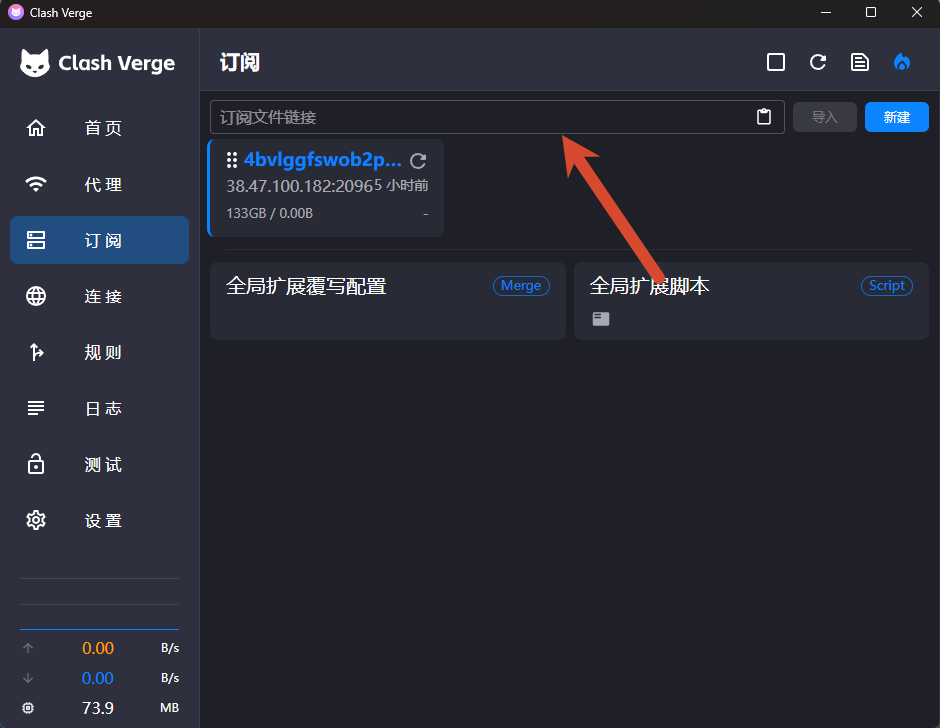
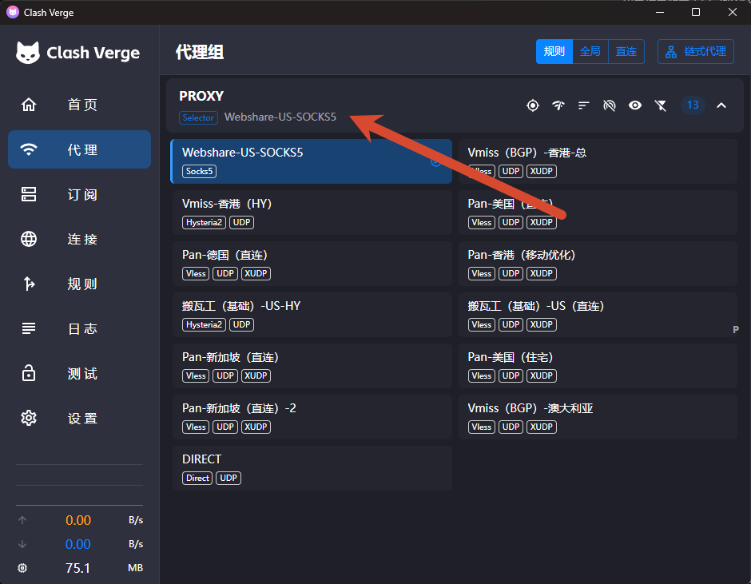
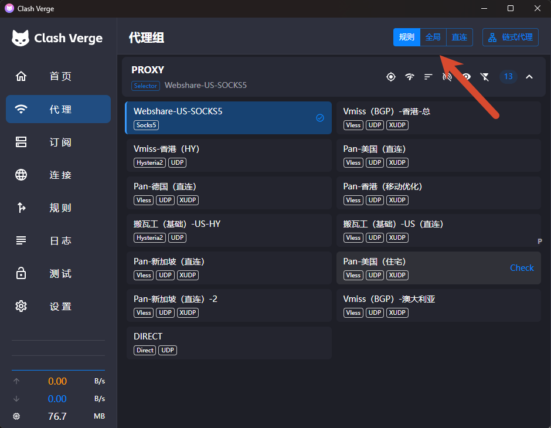
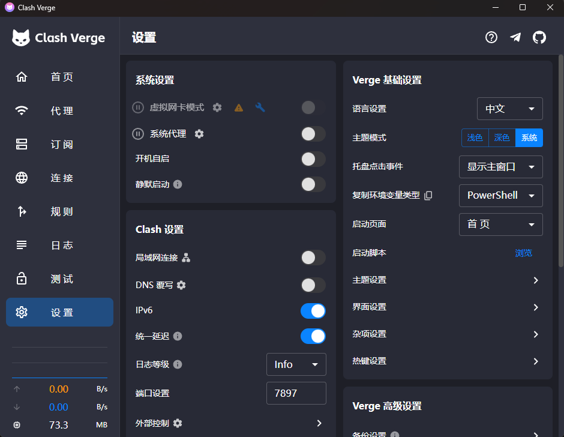
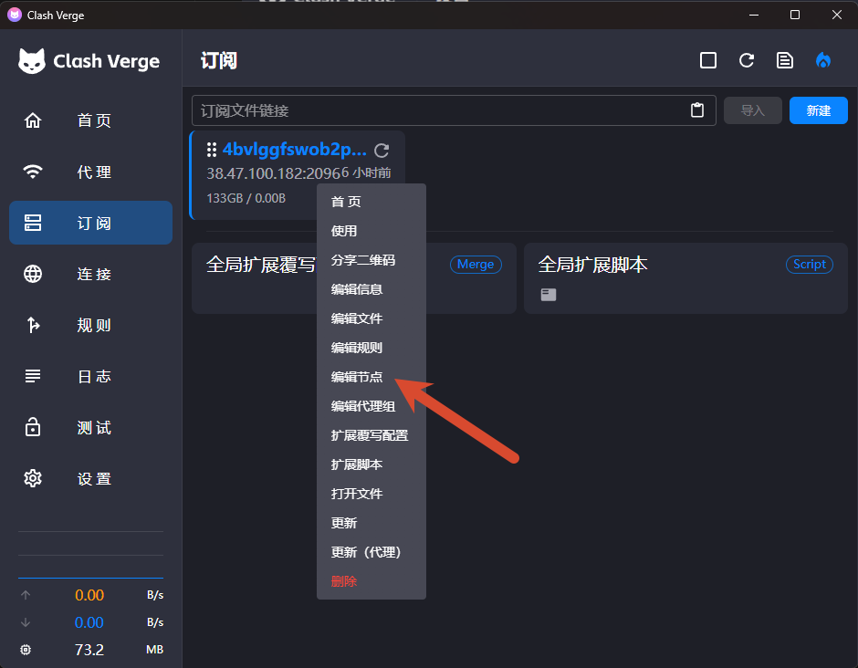
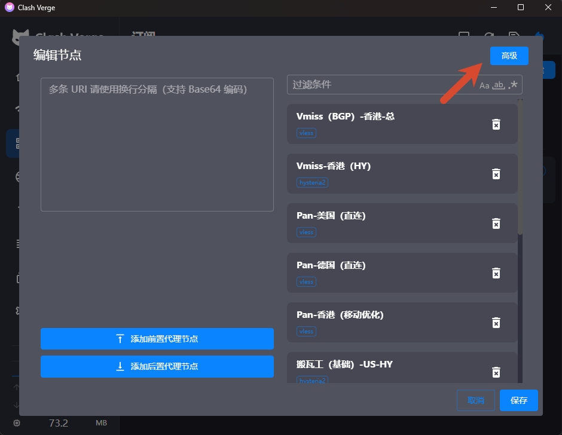
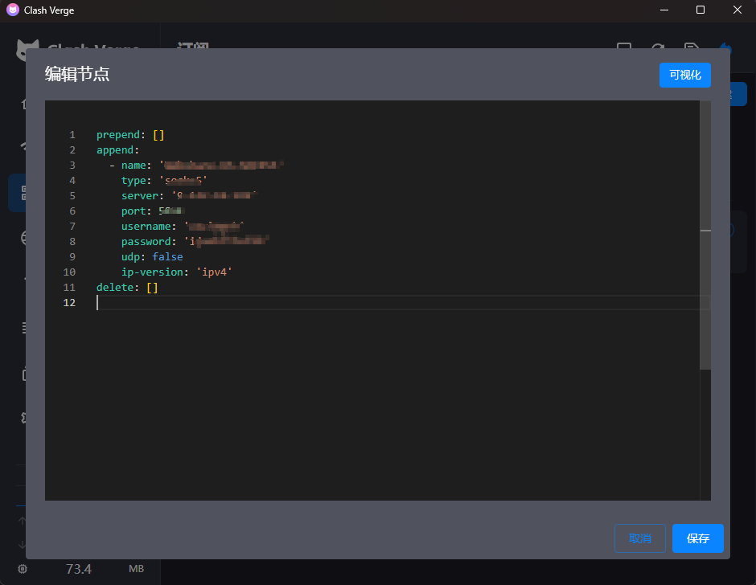

# 🎁 [主标题] 

{ width="300" align=left style="border-radius: 8px; margin-right: 20px; box-shadow: 0 4px 10px rgba(0,0,0,0.1); margin-bottom: 10px;" }

**本期要点：** [本期从订阅链接导入和节点选择开始，讲解规则、全局、直连模式以及系统代理与 TUN 的区别，并演示链式代理的配置方法和常见连接问题排查，适合从 Clash for Windows 迁移到 Clash Verge Rev 的新手参考。]。

<div style="margin-top: 25px; text-align: center;">
  <a href="[YouTube链接]" target="_blank" class="md-button md-button--neutral" style="display: inline-flex; align-items: center; gap: 8px; padding: 10px 24px; font-size: 0.85rem; border-radius: 20px; text-decoration: none; font-weight: bold; border: 1px solid rgba(0,0,0,0.1); transition: all 0.3s ease;">
    <svg viewBox="0 0 576 512" style="height: 1.1em; fill: #FF0000; margin: 0; display: block;"><path d="M549.655 124.083c-6.281-23.65-24.787-42.276-48.284-48.597C458.781 64 288 64 288 64S117.22 64 74.629 75.486c-23.497 6.322-42.003 24.947-48.284 48.597-11.412 42.867-11.412 132.305-11.412 132.305s0 89.438 11.412 132.305c6.281 23.65 24.787 41.5 48.284 47.821C117.22 448 288 448 288 448s170.781 0 213.371-11.486c23.497-6.321 42.003-24.171 48.284-47.821 11.412-42.867 11.412-132.305 11.412-132.305s0-89.438-11.412-132.305zm-317.51 213.508V175.185l142.739 81.205-142.739 81.201z"/></svg>
    立即观看完整视频
  </a>
</div>

<br clear="left">
<!-- more -->

## ⬇️ Clash Verge Rev 官方下载

[点击前往 GitHub Releases 下载最新版](https://github.com/clash-verge-rev/clash-verge-rev/releases/latest)

## ⬇️ v2rayN 与 Shadowrocket 官方下载

- **v2rayN：**[GitHub Releases 下载最新版](https://github.com/2dust/v2rayN/releases/latest)
- **Shadowrocket：**[Apple App Store 官方下载](https://apps.apple.com/us/app/shadowrocket/id932747118)

## 🔗 本期相关服务推荐

### 🚀 视频同款良心云机场

博主折腾互联网和各类网络工具多年，这款是在我实际体验过的同类机场中，目前价格最低的一档，同时节点速度表现也相当不错，适合预算有限、流量需求较大的用户。
邀请码：zwTTkkF7

[点击查看视频同款机场](https://xn--9kqz23b19z.com/#/register?code=zwTTkkF7)

### 🖥️ 搬瓦工 VPS 推荐

如果你更倾向于自己搭建节点，希望拥有独立服务器和更高的配置自由度，也可以选择搬瓦工 VPS。

[点击查看搬瓦工 VPS](https://bandwagonhost.com/aff.php?aff=82013)

### 📖 静态住宅 IP

- 👉 **本期视频同款静态 IP（Webshare）**：[点击跳转](https://www.webshare.io/?referral_code=lq6qy4n0ui6c)

---

## 一、导入订阅链接

首先从服务商后台复制 Clash 或 Mihomo 格式的订阅链接。

打开 Clash Verge Rev，点击首页的“导入订阅”：

1. 粘贴订阅链接；
2. 等待客户端获取配置；
3. 进入左侧“订阅”页面；
4. 找到刚刚导入的订阅；
5. 点击更新；
6. 点击“使用”或“激活”。

成功以后，进入“代理”页面应该能看到不同地区的节点。



---

## 二、选择并使用节点

进入左侧“代理”页面：

1. 选择需要使用的代理组；
2. 点击延迟测试；
3. 选择一个延迟正常的节点；
4. 回到首页；
5. 将代理模式设置为“规则”；
6. 开启“系统代理”；
7. 打开浏览器测试网站；
8. 查询当前出口 IP 是否发生变化。



推荐日常使用：

```text
规则模式 + 系统代理
```

### 规则、全局与直连模式的区别

| 模式 | 流量处理方式 | 适用场景 | 优点 | 缺点 |
| --- | --- | --- | --- | --- |
| **规则** | 根据域名、IP、地理位置等预设规则自动分流；需要代理的流量走节点，其余流量直接连接。 | 日常使用，例如境外网站走代理、国内网站直连。 | 自动分流，兼顾访问速度和代理需求，适合长期使用。 | 依赖规则集的准确性；规则过期或匹配错误时，部分网站可能无法正常访问。 |
| **全局** | 原则上所有被 Clash 接管的网络流量都通过当前选择的代理节点转发。 | 测试节点、排查规则问题，或者临时让大部分流量强制经过代理。 | 配置简单，可以快速确认代理节点是否正常工作。 | 访问国内网站可能变慢；流量消耗更大；部分本地服务可能受到影响。 |
| **直连** | 被 Clash 接管的流量不经过代理节点，直接连接目标服务器。 | 访问国内服务、局域网设备，或者临时停止使用代理。 | 访问本地及国内服务速度快，不消耗代理流量。 | 无法通过代理访问受限制的境外资源，也不会隐藏真实出口 IP。 |

> 日常使用建议选择“规则模式”；测试节点或排查分流问题时选择“全局模式”；暂时不需要代理时选择“直连模式”，或者直接关闭系统代理与虚拟网卡模式。



## 三、系统代理与 TUN 模式


### 系统代理

适合浏览器和大部分支持系统代理的软件，配置简单，建议新手优先使用。

### TUN 模式 (虚拟网卡模式)

适合不读取系统代理的应用、游戏和部分命令行程序。

如果普通系统代理已经够用，就没有必要开启 TUN。开启 TUN 后出现断网时，应先关闭其他 VPN、v2rayN 和代理软件，避免虚拟网卡或路由冲突。



---

## 四、链式代理：机场节点 + 住宅 IP

链式代理可以让流量先经过机场节点，再通过住宅 IP 访问目标网站：

```text
本地设备 → 机场节点（入口）→ SOCKS5 住宅代理（出口）→ 目标网站
```

### 1. 添加 SOCKS5 住宅节点

进入 Clash Verge Rev 的“订阅”页面，找到正在使用的订阅配置，选择“编辑节点”，然后切换到“高级”模式。




按照下面的 YAML 格式填写：

```yaml
append:
  - name: "住宅IP出口"
    type: socks5
    server: "proxy.example.com"
    port: 12345
    username: "你的用户名"
    password: "你的密码"
    udp: false
    ip-version: "ipv4"
```

需要替换的内容：

- `server`：住宅代理的服务器地址或 IP；
- `port`：住宅代理端口；
- `username`：代理用户名；
- `password`：代理密码；
- `udp`：代理商明确支持 UDP 时，可以改为 `true`。



如果 SOCKS5 代理不需要账号密码，可以删除下面两行：

```yaml
username: "你的用户名"
password: "你的密码"
```

填写完成后点击“保存”，住宅代理便会作为一个独立节点出现在代理列表中。

### 2. 组成代理链

进入“代理”页面，点击右上角的“链式代理”：

1. 将机场或自建节点添加到最上方，作为入口节点；
2. 将 SOCKS5 住宅节点放在下方，作为出口节点；
3. 确认节点顺序无误后连接代理链；
4. 打开 IP 查询网站，检查当前出口是否已经变成住宅 IP。

正确顺序如下：

```text
机场节点（入口）
        ↓
住宅 IP 节点（出口）
        ↓
目标网站
```

> 链式代理中，最上方是入口节点，最下方是最终出口节点。任何一个节点失效，整条代理链都可能无法连接。


# 🧰 常见问题与解决方法

## 1. 订阅链接导入失败

检查以下内容：

- 订阅是否过期；
- 套餐流量是否耗尽；
- 链接是否复制完整；
- 链接前后是否存在空格；
- 服务商是否提供 Clash/Mihomo 格式；
- 当前网络能否访问订阅服务器；
- 系统日期和时间是否正确。

如果已有其他可用节点，可以尝试“通过代理更新订阅”。

---

## 2. 导入成功，但没有节点

可能原因：

- 订阅返回的是登录页面，而不是节点配置；
- 订阅格式不兼容；
- 节点被过滤条件隐藏；
- 订阅没有成功激活；
- 服务商限制了客户端类型。

可以尝试重新更新、重新激活订阅，或者联系服务商获取 Clash/Mihomo 专用订阅。

---

## 3. 所有节点都显示 Timeout

依次检查：

1. 本地网络是否正常；
2. 更换其他节点；
3. 重启 Mihomo 内核；
4. 检查防火墙和安全软件；
5. 查看日志中的具体错误；
6. 使用浏览器实际测试节点。

节点显示 `Timeout` 不一定代表完全不可用，有时只是默认测速地址无法访问。

---

## 4. 选择节点后仍然无法访问

检查：

- 是否开启了系统代理或 TUN；
- 是否选择了正确的代理组；
- 当前是否误选“直连”模式；
- 浏览器是否使用了独立代理扩展；
- 其他代理客户端是否正在修改系统代理；
- 当前规则是否将目标网站设置为直连。

可以暂时切换到“全局”模式测试。如果全局模式正常，通常说明问题出在分流规则。

---

## 5. Clash 关闭后无法联网

这通常是 Windows 系统代理没有正确恢复。

打开：

```text
Windows 设置
→ 网络和 Internet
→ 代理
→ 手动设置代理
```

关闭“使用代理服务器”，然后重新打开浏览器。

---

## 6. Clash Verge Rev 与 v2rayN 冲突

两个客户端可以同时安装，但不要同时接管系统流量。

建议确保：

- 只开启其中一个客户端的系统代理；
- 只开启其中一个客户端的 TUN；
- 两个客户端使用不同的本地端口；
- 不同时开启双方的系统代理守卫。

如果平时使用 v2rayN，只在 Clash 中编辑节点，应保持 Clash 的系统代理和 TUN 关闭。

---

## 7. 开启 TUN 后断网

可以依次尝试：

1. 关闭其他 VPN 和代理客户端；
2. 关闭 DNS 覆写；
3. 恢复默认 TUN 设置；
4. 重启 Mihomo 内核；
5. 重新安装服务模式；
6. 暂时改回系统代理。

---

## 总结

Clash Verge Rev 的基础使用流程可以概括为：

```text
导入订阅
→ 激活订阅
→ 选择节点
→ 使用规则模式
→ 开启系统代理
→ 测试出口 IP
```

普通用户优先使用“规则模式 + 系统代理”。只有普通系统代理无法接管目标应用时，再考虑开启 TUN。

## ⚠️ 免责声明
* 本文内容仅供技术交流，请遵守当地法律法规。