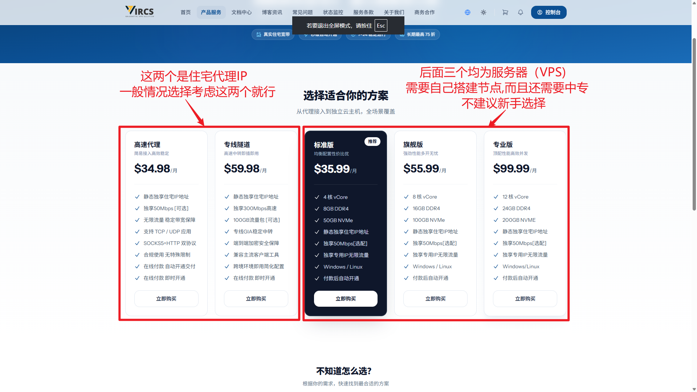

---
hide:
  - navigation
  - toc
---

[⬅️ 返回主目录](./index.md)
# 🌐 静态住宅 IP 深度评测与推荐

> **📝 住宅代理现状说明：** 由于真实的物理住宅 IP 资源极其稀缺且价格昂贵，市面上绝大多数住宅代理实际上是使用机房 IP 伪装的。存在即合理，大家不必过度担忧，只需筛选出伪装度高、相对纯净的节点即可。以下高性价比平台供大家参考：

---

## 🥇 纯血物理宽带：（真）美国静态住宅 IP

* **🔗 VIRCS：（真）美国静态住宅 IP ：** [👉 官网地址](https://www.vircs.com/welcome?vcd=9467e966)

> **📝 核心优势：** 并非市面常见的数据中心（机房）包装 IP，而是 **100% 真实的美国加州本地实体公寓宽带**，由美国老牌电信巨头 **AT&T** 原生分配。网络环境与真实的美国本地家庭用户完全一致，做到真正的一人一 IP，静态物理独享。

> **✅ 适合场景：** 适合高价值账号，或者高价值店铺账号！（刚起步，不建议用这么贵的IP，做起来之后可以考虑这个资源）

---

## 🥈 高性价比平替：（伪）住宅 IP / ISP 代理

| 代理平台 | 核心特点与站长避坑提示 | 优惠码 | 跳转链接 |
| :--- | :--- | :--- | :--- |
| 🍠 Webshare | **价格极低** **注意：** 有概率分配到机房 IP，需手动刷新替换筛选。目前群友反馈本平台仅**美国IP**质量还行,如需**其他地区IP**,请考虑其他平台。[没有国际虚拟卡的可以查看教程][虚拟卡推荐表] | - | [🔗 点击获取 (每月不到 6 元)](https://www.webshare.io/?referral_code=lq6qy4n0ui6c) |
| 📦 MIYAIP | **自带中转节点（可以直连）** | `V88D` | [🔗 点击跳转][miyaip] |
| 📲 985 Proxy | 常规住宅代理，适合作为备选方案。 | `XIAOV007` | [🔗 点击跳转][985Proxy] |
| 🏠 Talor | 注册时填写专属邀请码可获取相关优惠。 | `as5pidqk` | [🔗 点击跳转](https://dashboard.talordata.com/reg?inviter_code=as5pidqk) |
| ☁️ Kookeey | 常见的静态 / 动态 ISP 代理平台，覆盖较广。 | - | [🔗 点击跳转](https://www.kookeey.com/?aff=86916142) |

--8<-- "includes/links.md"